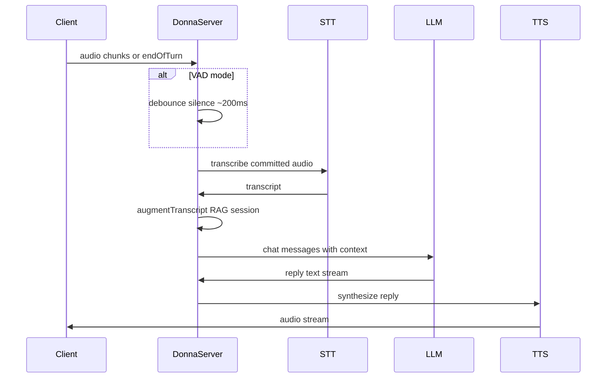

# Voice turn orchestration (Donna server)

Near-live v1: **push-to-talk** or **VAD + commit**, then cascaded STT → augment → LLM → streaming TTS.

Reference implementation sketch: [turn-pipeline.ts](./turn-pipeline.ts).

## Sequence



## States (client ↔ server)

| Client state | Server phase |
|--------------|--------------|
| `idle` | Waiting |
| `requesting` | Permission / session setup |
| `listening` | Buffering audio; optional STT partials |
| (processing) | STT → augment → LLM → TTS |
| `idle` | Turn complete |

## Turn commit triggers

1. **Push-to-talk** — client sends `endOfTurn: true` with full recording.
2. **VAD** — server detects silence for `silenceMs` (default 400–600ms) after speech.

## Context augmentation

```typescript
// Pseudocode — see turn-pipeline.ts
const augmented = await augmentTranscript({
  transcript,
  userId,
  sessionId,
});
// augmented.text → LLM user message
// augmented.retrievedDocs → optional tool-less RAG
```

## LLM message shape

```json
{
  "messages": [
    { "role": "system", "content": "<persona + stable facts>" },
    {
      "role": "user",
      "content": "[Retrieved: ...]\n[Session: ...]\nUser said: \"<transcript>\""
    }
  ]
}
```

All provider calls use **`OPENROUTER_API_KEY`**:

- STT: `POST https://openrouter.ai/api/v1/audio/transcriptions` (`openai/whisper-1`)
- LLM: `POST https://openrouter.ai/api/v1/chat/completions` with `stream: true` (text only)
- TTS: same chat endpoint with `modalities: ["text","audio"]` and `openai/gpt-4o-mini-tts`

## Error handling

| Failure | Behavior |
|---------|----------|
| STT empty / low confidence / noise | Silent skip; at most one retry prompt per session on clear failed attempt |
| LLM timeout | Retry once; else spoken apology via TTS |
| TTS failure | Fall back to text-only response on client |
| User interrupts (v2) | Cancel in-flight TTS; clear buffer |

## Latency budget (target)

| Step | Target |
|------|--------|
| STT | 200–500ms |
| RAG + augment | 100–300ms |
| LLM (first token) | 300–800ms |
| TTS (first byte) | 200–400ms |
| **Total to first audio** | ~1–2s |

## v2 extensions (not v1)

- Streaming STT partials to client captions
- Barge-in: cancel TTS on new `speech_started`
- GPT Realtime path if sub-500ms duplex required
