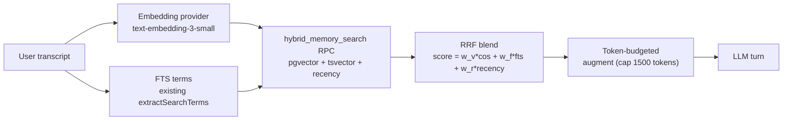

# Improvement Plan 1: Memory Quality Upgrade

**Status:** Proposed
**Pillar:** Memory quality
**Constraint:** Ship fast
**Target:** Best AI second brain — biggest recall quality jump per hour invested

## Goal

Donna's retrieval today is **boolean FTS ordered by recency** ([`storage/knowledge.go:123-137`](../../donna-server-go/internal/storage/knowledge.go) and [`storage/notes_store.go:171-190`](../../donna-server-go/internal/storage/notes_store.go)), with a hard 10-item cap and no reranking ([`pipeline/augment.go:33-75`](../../donna-server-go/internal/pipeline/augment.go)). That's the single biggest thing standing between donna and "best AI second brain." This plan adds hybrid semantic search and fixes two latent memory-loss bugs — shippable in days.



## Phase 1 — Schema + embeddings infra

### 1.1 New migration: `supabase/migrations/0001_memory_upgrade.sql`

```sql
create extension if not exists vector;

alter table kb_facts add column if not exists embedding vector(1536);
alter table notes    add column if not exists embedding vector(1536);

create index if not exists kb_facts_embedding_idx
  on kb_facts using hnsw (embedding vector_cosine_ops)
  with (m = 16, ef_construction = 64);
create index if not exists notes_embedding_idx
  on notes using hnsw (embedding vector_cosine_ops)
  with (m = 16, ef_construction = 64);
```

Also create the `supabase/migrations/` folder (currently empty per the deep dive) and move existing `knowledge_base.sql` / `notes.sql` content into `0000_init.sql` so there's a real migration history.

### 1.2 Hybrid search RPC

Single PostgREST-callable function that blends all three signals server-side. Takes the query embedding as a param (generated in Go, not Postgres) so we don't need a Supabase Edge Function or `pg_ai`:

```sql
create or replace function match_memory(
  p_user_id uuid,
  p_query_embedding vector(1536),
  p_query_text text,
  p_limit int default 20
) returns table (
  source text,        -- 'fact' | 'note'
  id uuid,
  text text,          -- formatted snippet
  score float
)
language sql stable as $$
  with fact_vec as (
    select id, fact as body, entity_name, topic,
      1 - (embedding <=> p_query_embedding) as vec_score
    from kb_facts
    where user_id = p_user_id and active = true
      and embedding is not null
    order by embedding <=> p_query_embedding
    limit p_limit
  ),
  fact_fts as (
    select id, fact as body, entity_name, topic,
      ts_rank(search_vector, websearch_to_tsquery('english', p_query_text)) as fts_score
    from kb_facts
    where user_id = p_user_id and active = true
      and search_vector @@ websearch_to_tsquery('english', p_query_text)
    order by fts_score desc
    limit p_limit
  ),
  -- same shape for notes (title || ': ' || preview as body)
  ...
  blended as (
    select 'fact' as source, id, body, entity_name, topic,
      coalesce(f.vec_score, 0) * 0.5
        + coalesce(g.fts_score, 0) * 0.3
        + (1.0 / (1 + extract(epoch from now() - f_created) / 86400 / 30)) * 0.2
        as score
    from fact_vec f
    left join fact_fts g using (id)
    ...
  )
  select source, id, body, score
  from blended
  order by score desc
  limit p_limit;
$$;
```

Weights (0.5 vector / 0.3 FTS / 0.2 recency) are a starting point — tune later. Recency term uses a 30-day half-life.

### 1.3 Embeddings provider

New file [`donna-server-go/internal/pipeline/providers/embeddings.go`](../../donna-server-go/internal/pipeline/providers/embeddings.go):

- `type Embeddings struct { APIKey, Model string }`
- `Embed(ctx, []string) ([][]float32, error)` — calls OpenAI `POST /v1/embeddings` with `text-embedding-3-small` (1536 dims, $0.02/1M tokens — negligible cost).
- `EmbedOne(ctx, string) ([]float32, error)` — convenience wrapper.
- Batch up to 100 inputs per call.

Config additions in [`internal/config/config.go`](../../donna-server-go/internal/config/config.go): `DONNA_EMBEDDING_MODEL` (default `text-embedding-3-small`), reuse existing `OPENAI_API_KEY`.

## Phase 2 — Wire embeddings into writes

### 2.1 Fact writes

[`storage/knowledge_store.go:InsertFacts`](../../donna-server-go/internal/storage/knowledge_store.go) — generate embedding for each `fact` string before insert, add `embedding` to the insert body. Same for `applyCompilerOutput`'s supersede-insert path.

### 2.2 Note writes

[`storage/notes_store.go:CreateNote`](../../donna-server-go/internal/storage/notes_store.go) and `UpsertNoteFromSource` — embed `title || "\n" || content` before insert.

### 2.3 Backfill

One-off Go command `donna-server-go/cmd/backfill/main.go` (run once locally against prod Supabase):
- Page through `kb_facts where embedding is null and active = true` and `notes where embedding is null`, batch-embed (100/call), patch rows.
- Idempotent — safe to re-run. ~10k facts + notes would cost under $0.01 in embeddings.

## Phase 3 — Rewrite retrieval to use the RPC

### 3.1 New `Supabase.RPC`

Add to [`storage/supabase.go`](../../donna-server-go/internal/storage/supabase.go): `RPC(ctx, function string, body map[string]any, dest any) error` — `POST /rest/v1/rpc/<function>` with the existing `headers()`.

### 3.2 Replace `RetrieveFacts` + `RetrieveNoteSnippets`

Replace the two separate retrievers in [`storage/knowledge.go:139-186`](../../donna-server-go/internal/storage/knowledge.go) and [`storage/notes_store.go:198-247`](../../donna-server-go/internal/storage/notes_store.go) with a single `RetrieveMemory(ctx, userID, transcript, limit)` that:
1. Generates query embedding via `Embeddings.EmbedOne`.
2. Calls `match_memory` RPC.
3. Returns blended, ranked results.

Keep the old functions as fallback if `Embeddings` is nil or RPC fails (graceful degradation to current FTS path).

### 3.3 Token-budgeted augment

Rewrite [`pipeline/augment.go:DefaultAugment`](../../donna-server-go/internal/pipeline/augment.go):
- Call `RetrieveMemory` once (instead of notes + facts separately).
- Cap by **token budget** (~1500 tokens, ~6000 chars) instead of hard 10-item count. Truncate from the tail (lowest score).
- Drop the `seen`-map dedup (RPC already dedups by id).
- Format: keep the `[Retrieved: ...]` pipe-delimited shape so the LLM prompt template doesn't change.

## Phase 4 — Fix two latent memory bugs (free wins while we're in there)

### 4.1 Profile overwrite bug

[`knowledge/compiler.go:217-222`](../../donna-server-go/internal/knowledge/compiler.go) — LLM's `profile_summary` **fully overwrites** the previous summary, so if the LLM drops the user's name (which the live-facts path merged in), it's lost.

Fix: change `UpsertUserProfileSummary` to a merge — load existing, send both to a cheap LLM merge pass (or simpler: if LLM output doesn't contain any word from `ExtractObviousFacts`-detected names, prepend the name sentence from the existing summary). Simplest correct version: keep a separate `kb_user_profiles.identity_facts text[]` column for machine-detected name/pronouns and always prepend it to the LLM-generated `summary` at read time in `GetUserProfileSummary`.

### 4.2 Silent supersede drops

[`knowledge/compiler.go:224-257`](../../donna-server-go/internal/knowledge/compiler.go) — supersede uses case-insensitive `strings.Contains` on fact text; if the LLM paraphrases `old_fact`, the supersede is **silently dropped** (not even logged).

Fix:
- Change the compiler prompt in [`maintainer_prompt.go`](../../donna-server-go/internal/knowledge/maintainer_prompt.go) to ask for `old_fact_id` (UUID) instead of `old_fact` substring — we already include fact IDs in `BuildCompilerUserMessage`.
- Match by ID directly. If the LLM returns a malformed/missing ID, log a warning and fall back to substring match.
- Add a `kb_compile_log.supersede_misses jsonb` column to record dropped supersedes for debugging.

## Files touched

| File | Change |
|------|--------|
| `supabase/migrations/0000_init.sql` (new) | Consolidate existing schema |
| `supabase/migrations/0001_memory_upgrade.sql` (new) | pgvector, embedding cols, HNSW indexes, `match_memory` RPC, `supersede_misses` column, `identity_facts` column |
| `donna-server-go/internal/pipeline/providers/embeddings.go` (new) | OpenAI embeddings client |
| `donna-server-go/internal/config/config.go` | `DONNA_EMBEDDING_MODEL` |
| `donna-server-go/internal/storage/supabase.go` | `RPC` method |
| `donna-server-go/internal/storage/knowledge.go` | `RetrieveMemory`, keep `RetrieveFacts` as fallback, profile identity_facts prepend |
| `donna-server-go/internal/storage/knowledge_store.go` | Embed on `InsertFacts`, ID-based supersede, `supersede_misses` logging |
| `donna-server-go/internal/storage/notes_store.go` | Embed on `CreateNote`/`UpsertNoteFromSource` |
| `donna-server-go/internal/knowledge/compiler.go` | Profile merge, ID-based supersede |
| `donna-server-go/internal/knowledge/maintainer_prompt.go` | Ask for `old_fact_id` |
| `donna-server-go/internal/pipeline/augment.go` | Single `RetrieveMemory` call, token-budgeted |
| `donna-server-go/cmd/backfill/main.go` (new) | One-off embedding backfill |

## What's explicitly out of scope (follow-ups)

- Entity graph table (`kb_entities` + relationships) — the `entity_name` column is already there; normalizing it is a Phase 5 once hybrid search proves out.
- Walking `supersedes_id` chain for "current value of X" queries — needs the entity graph.
- Temporal extraction (`valid_from`/`valid_until` on facts) — Phase 6.
- Memory UI in the web app (browse/edit `kb_facts`) — separate effort.
- Streaming STT / OpenAI Realtime — different pillar, not memory.

## Validation

- `npm run test:voice` smoke test still passes.
- Manual: ask donna "what's my name" after telling it via a previous session — should hit the new RPC.
- Backfill script reports 0 rows with null embeddings on second run.
- Compare retrieval: run 10 sample queries through old FTS path vs new hybrid path, eyeball recall quality.
- Check `kb_compile_log.supersede_misses` after a few sessions — should be empty or near-empty.

## Ship order

1. Migration + embeddings provider + `Supabase.RPC` (no behavior change yet).
2. Embed on writes + backfill (no behavior change yet, embeddings populate silently).
3. Flip retrieval to `RetrieveMemory` + token-budgeted augment (the big visible win).
4. Profile overwrite fix + supersede-by-ID (correctness wins).

Each step is independently mergeable. Step 3 is the "best AI second brain" moment.
