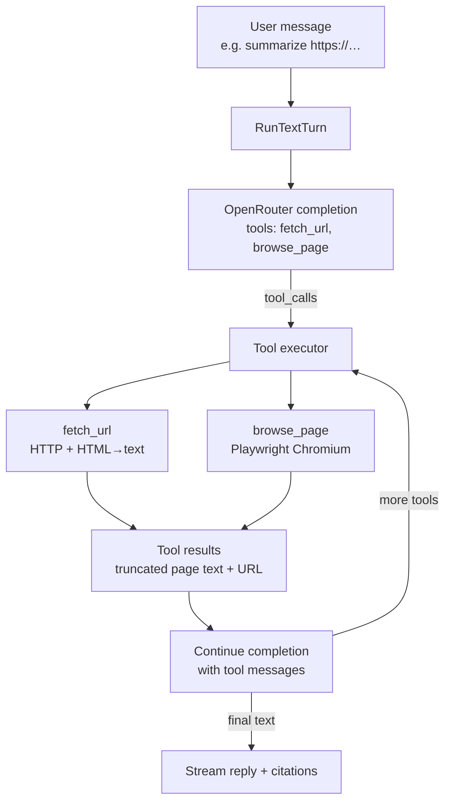

# Improvement Plan 2: Chat Browser Tool

**Status:** Proposed  
**Pillar:** Chat grounding / agent tools  
**Constraint:** Reliability first, then cost/speed  
**Target:** Donna can open a URL mid-chat, read the page, and answer from it — without the user pasting content by hand

## Goal

Today Donna has two weaker web capabilities, neither of which is “browse a site in chat”:

1. **OpenRouter web search** (`web_search` flag → `plugins: [{ id: "web" }]`) — search snippets + citations, not page navigation.
2. **One-shot URL fetch** (`ingest.ExtractURL`) — plain HTTP GET + HTML→text for pasted URLs / knowledge ingest. No JS, no multi-step navigation, no mid-turn tool loop.

Chat is a **single** streaming completion in [`pipeline/text_turn.go`](../../donna-server-go/internal/pipeline/text_turn.go). There is no OpenAI-style `tools` / `tool_calls` loop. Intents/`open_url` only propose opening a link on the device — they do not fetch content.

This plan adds a real **chat tool** surface and a tool-calling loop so Donna can surf a website when the user asks (or when a URL needs JS-rendered content).



## Decision: Playwright first, Lightpanda later

| Option | Role for Donna |
|--------|----------------|
| **`fetch_url` (reuse `ExtractURL`)** | Default for static / mostly-HTML pages — cheap, already exists |
| **Playwright + Chromium** | Production browser when JS/SPA/rendered content is needed |
| **Lightpanda** | Optional later fast path — beta, no screenshots/layout, weaker site compatibility |

**Recommendation:** Ship Playwright as the real browser backend. Keep Lightpanda as a future optimization behind the same `browse_page` interface (CDP-compatible), with Chromium fallback on failure. Do not make Lightpanda the sole production browser for arbitrary user URLs.

## Non-goals (this plan)

- Replacing OpenRouter `web_search` (keep as optional search; browsing is complementary).
- Folding browse into intents/`open_url` (wrong lifecycle — those are post-turn, confirm-to-open-on-device actions).
- Full autonomous “agent that lives in a browser session for hours.”
- Voice browse in v1 (voice path has no `web_search` today either; add after text chat works).
- Scraping behind logins / CAPTCHA solving / credential vault.

---

## Phase 0 — Product behavior

### 0.1 When Donna browses

Donna should call browse tools when:

- The user pastes or names a URL and asks about its content.
- Answering requires reading a specific page (docs, blog, product page) and memory/search snippets are insufficient.
- A prior `fetch_url` returned empty/useless content and the page likely needs JS.

Donna should **not** browse by default for every turn (latency + cost). Prefer: memory → optional web search → `fetch_url` → `browse_page` only if needed.

### 0.2 UX

- No new mandatory toggle for “browser” in v1 — model decides via tools (same pattern as agent tool use).
- Optional later: keep `web_search` toggle; add a “Allow browsing” preference if we want user control.
- Stream a light phase/status to the client while tools run (e.g. `browsing`, `fetching`) so the UI can show “Reading example.com…” instead of a silent hang.
- Attach **citations** for browsed URLs using existing `MemoryCitation` / `source: "web"` plumbing on web + app.

### 0.3 Success criteria

- User: “What’s on https://example.com/pricing?” → Donna returns accurate summary grounded in fetched/browsed content, with a citation link.
- JS-heavy marketing SPA that fails `ExtractURL` succeeds via Playwright.
- Private-network / localhost URLs are blocked.
- Tool loop caps prevent runaway multi-hop browsing.

---

## Phase 1 — Tool-calling foundation (server)

**Prerequisite for any browse tool.** Without this, tools cannot run mid-turn.

### 1.1 Extend LLM provider for tools

File: [`donna-server-go/internal/pipeline/providers/llm.go`](../../donna-server-go/internal/pipeline/providers/llm.go)

- Extend `ChatMessage` to support tool-related fields used by OpenRouter/OpenAI:
  - `tool_calls` on assistant messages
  - `tool_call_id` + `role: "tool"` for results
  - optional `name` on tool messages
- Extend `ChatCompletionOptions` with:
  - `Tools []ToolDefinition`
  - `ToolChoice` (`"auto"` | `"none"` | specific)
- Parse streaming (or non-stream round-trips) for `tool_calls` deltas / finished tool call payloads.
- Return structured result from completion:

```go
type CompletionResult struct {
    Text      string
    ToolCalls  []ToolCall
    Citations  []WebCitation
    FinishReason string // "stop" | "tool_calls" | ...
}
```

**Implementation note:** First version may use **non-streaming** requests for tool rounds (simpler parse), then stream only the **final** assistant text to the client. Alternative: stream throughout and buffer tool-call JSON until the tool round completes. Prefer non-stream tool rounds + stream final answer for v1 speed of shipping.

### 1.2 Tool registry + executor

New package: `donna-server-go/internal/pipeline/tools/`

```
tools/
  registry.go    // Register(name, def, handler)
  types.go       // Definition, Call, Result
  fetch_url.go   // Phase 2
  browse.go      // Phase 3
  safety.go      // URL allow/block rules
  loop.go        // RunToolLoop(ctx, llm, messages, tools, limits)
```

`RunToolLoop` algorithm:

1. Call LLM with tools enabled.
2. If `finish_reason == tool_calls`, execute each call (sequential in v1; parallel later if safe).
3. Append assistant + tool messages; increment round counter.
4. Repeat until final text or `MaxRounds` (default **3**).
5. Enforce per-tool timeouts and total wall-clock budget (e.g. **45s**).

### 1.3 Wire into `RunTextTurn`

File: [`pipeline/text_turn.go`](../../donna-server-go/internal/pipeline/text_turn.go)

- After building `messages`, if tools are enabled for the turn, call `RunToolLoop` instead of a single `StreamCompletionWithOptions`.
- Emit a new turn phase (or SSE event) when entering a tool round so chat UI can show status.
- Merge tool-derived citations into the existing citations response path in [`chat/handler.go`](../../donna-server-go/internal/chat/handler.go).

### 1.4 System prompt guidance

Add a short block to the chat system prompt (or mode-specific prompt):

- Prefer `fetch_url` for simple pages.
- Use `browse_page` when content is missing/empty after fetch or when the user implies interactive/JS content.
- Cite sources; do not invent page content.
- Do not browse localhost, private IPs, or `file:` URLs.

### 1.5 Tests

- Unit tests for request body shape with `tools`.
- Fake LLM returning one tool call → executor stub → final answer.
- Cap enforcement: 4th tool round aborts with graceful message.

---

## Phase 2 — `fetch_url` tool (cheap path)

Reuse and harden existing extractors — this alone fixes many “paste a docs URL” cases **without** Playwright.

### 2.1 Tool definition

```json
{
  "type": "function",
  "function": {
    "name": "fetch_url",
    "description": "Fetch a public HTTP(S) page and return extracted text. Prefer for static HTML/docs.",
    "parameters": {
      "type": "object",
      "properties": {
        "url": { "type": "string" },
        "max_chars": { "type": "integer", "description": "Optional truncate length" }
      },
      "required": ["url"]
    }
  }
}
```

### 2.2 Implementation

- Handler wraps [`ingest.ExtractURL`](../../donna-server-go/internal/knowledge/ingest/extractors.go).
- Apply `safety.ValidatePublicURL` before fetch (see Phase 4).
- Return truncated text + title/host; include final URL after redirects if available (upgrade extractor to expose redirect target).
- On empty body / non-HTML binary: return a structured error the model can use to decide on `browse_page`.

### 2.3 Relationship to attachment grounding

Keep current behavior: if the user message is a lone URL or has a URL attachment, existing grounding in [`chat/attachments.go`](../../donna-server-go/internal/chat/attachments.go) can still pre-fetch. Tools add **mid-turn** and **multi-URL** browsing the attachment path cannot do. Avoid double-fetching the same URL in one turn (simple URL cache keyed by session + normalized URL, TTL ~minutes).

### 2.4 Ship gate

Phase 2 can ship **before** Playwright if the tool loop exists — already a large UX win for docs/blogs/marketing HTML.

---

## Phase 3 — `browse_page` with Playwright

### 3.1 Architecture

Donna server stays Go. Playwright runs as a **sidecar** (Node) or managed browser service. Prefer a thin HTTP contract so Go never embeds Chromium.

```
donna-server-go  --HTTP-->  donna-browser (Node + Playwright)
                              |
                              +-- Chromium (headless)
```

Suggested new service directory: `donna-browser/` (or `scripts/browser-sidecar/`) with:

- `POST /browse` `{ url, actions?, wait_until?, max_chars? }`
- Response `{ url, title, text, status, error? }`
- Optional later: `{ screenshot_base64 }` for vision models

Env: `DONNA_BROWSER_URL` (e.g. `http://127.0.0.1:9229`). If unset, `browse_page` is registered as unavailable and only `fetch_url` is offered.

### 3.2 Tool definition

```json
{
  "type": "function",
  "function": {
    "name": "browse_page",
    "description": "Open a page in a real browser (JS executed). Use when fetch_url is insufficient.",
    "parameters": {
      "type": "object",
      "properties": {
        "url": { "type": "string" },
        "wait_ms": { "type": "integer" },
        "max_chars": { "type": "integer" }
      },
      "required": ["url"]
    }
  }
}
```

v1 actions: navigate + wait for network idle / selector timeout + extract `document.body.innerText` (or readability-style main content).  
v1.1 (optional): `click`, `scroll`, `extract_links` as separate tools or action array — only if product needs multi-step surfing.

### 3.3 Extraction quality

- Prefer main-content extraction (Readability / Mozilla / simple heuristic) over full `innerText` dump.
- Strip nav/footer noise when possible.
- Hard cap returned chars (e.g. 12–20k) before tool result is sent back to the LLM.
- Return markdown-ish text when easy; plain text is fine for v1.

### 3.4 Ops / deploy

- Docker image with Playwright browsers preinstalled for server environments that run the sidecar.
- Local dev: `npm run browser` + document in root README / server README.
- Timeouts: navigation 20s, total tool 30s.
- Concurrency: limit parallel browse sessions per process (e.g. 2–4) to bound Chromium RAM.

### 3.5 Managed alternative (optional fork)

If self-hosting Chromium is painful in the current deploy target, use Browserbase / similar with the **same** Go `browse_page` client interface. Decision can be env-driven (`DONNA_BROWSER_BACKEND=sidecar|browserbase`).

---

## Phase 4 — Safety, limits, observability

### 4.1 URL safety (`tools/safety.go`)

Reject:

- Non-`http`/`https` schemes
- Localhost, `127.0.0.1`, `0.0.0.0`, `::1`
- Private/link-local ranges (RFC1918, etc.) — resolve DNS and check **resolved** IPs (SSRF)
- Overly large responses (existing `MaxURLBytes` pattern)
- Optional blocklist for known malware hosts later

### 4.2 Abuse / cost controls

| Limit | Suggested default |
|-------|-------------------|
| Max tool rounds / turn | 3 |
| Max browse calls / turn | 2 |
| Max fetch calls / turn | 3 |
| Per-tool timeout | 15s fetch / 30s browse |
| Per-user rate (optional) | N browses / hour |

### 4.3 Logging

Log tool name, host (not full query string if sensitive), latency, success/fail, chars returned. Do not log full page bodies at info level.

### 4.4 Citations

Map each successful fetch/browse to a citation:

```go
MemoryCitation{ Source: "web", URL: finalURL, Title: title, Content: snippet }
```

Reuse client rendering in [`donna-web` MemoryCitations](../../donna-web/src/components/MemoryCitations.tsx) and the app equivalent.

---

## Phase 5 — Client UX (web + app)

Minimal client changes if the server streams status + citations:

1. **Status line** while phase is fetching/browsing (“Reading example.com…”).
2. **Citations** for tool-sourced URLs (already partially supported for OpenRouter web).
3. **No** requirement for a new compose-box toggle in v1.

Files likely touched:

- [`donna-web/src/hooks/useChatSession.ts`](../../donna-web/src/hooks/useChatSession.ts) / chat SSE parsing
- [`donna-web/src/services/chatApi.ts`](../../donna-web/src/services/chatApi.ts)
- App chat screen / `chatApi` mirrors

Protocol: extend SSE events or reuse `phase` with new values (`fetching`, `browsing`) in [`protocol/protocol.go`](../../donna-server-go/internal/protocol/protocol.go).

---

## Phase 6 — Follow-ups (after v1)

| Item | Notes |
|------|-------|
| Voice path | Same tool loop on voice turns after text is stable |
| Multi-step actions | click / form fill / paginate — only with tight allowlists |
| Screenshots → vision | Optional `browse_page` image for GLM vision model already configured |
| Lightpanda fast path | Same CDP/HTTP interface; fallback to Playwright on error |
| Persist browsed pages into knowledge | Optional “save to notes/KB” after browse |
| User preference | “Allow Donna to browse the web” |

---

## Suggested implementation order

| Step | Deliverable | Ships value alone? |
|------|-------------|--------------------|
| **A** | Phase 1 tool loop + registry | Infra only |
| **B** | Phase 2 `fetch_url` + safety + citations + UI status | **Yes — MVP** |
| **C** | Phase 3 Playwright sidecar + `browse_page` | Full browse |
| **D** | Phase 5 polish + rate limits + docs | Production hardening |
| **E** | Phase 6 follow-ups | Incremental |

**MVP recommendation:** Ship **A+B** first (tool loop + `fetch_url`). Many user complaints (“give it a website”) are solved without Chromium. Then **C** for JS-heavy sites.

---

## Files touched (expected)

| Area | Files |
|------|--------|
| LLM / tools | `pipeline/providers/llm.go`, new `pipeline/tools/*` |
| Turn orchestration | `pipeline/text_turn.go`, `pipeline/turn.go` |
| Chat API / SSE | `chat/handler.go`, `protocol/protocol.go` |
| URL fetch reuse | `knowledge/ingest/extractors.go` (redirect URL, safety hooks) |
| Config | `config/config.go` — `DONNA_BROWSER_URL`, tool limits |
| Browser sidecar | new `donna-browser/` (Node + Playwright) |
| Web client | `chatApi.ts`, chat hooks/components for phase + citations |
| App client | mirrored chat API / status UI |
| Docs | this plan; short README section for running the sidecar |

---

## Risks

| Risk | Mitigation |
|------|------------|
| Tool-loop latency feels slow | Status events; prefer `fetch_url`; stream final answer |
| Chromium memory on server | Sidecar concurrency limits; managed browser option |
| SSRF via browse/fetch | DNS + IP validation; block private ranges |
| Model over-browses | Max rounds; prompt guidance; optional user pref later |
| Playwright flaky sites | Timeouts + clear tool errors; fall back to “couldn’t read page” |
| Lightpanda chosen too early | Keep as Phase 6 optimization only |

---

## Open questions (resolve before Phase 3)

1. **Deploy target:** Can the Donna server host a Playwright sidecar, or should v1 use a managed browser API?
2. **Default on vs preference:** Auto tool use for all users, or gated behind a setting?
3. **Streaming policy:** Non-stream tool rounds + stream final (simpler) vs full streaming tool deltas?
4. **Knowledge write-back:** Should browsed content ever auto-ingest into KB, or only cite in-chat?

---

## Done when

- [ ] OpenRouter tool calls work end-to-end in `RunTextTurn`
- [ ] `fetch_url` available and cited in web + app chat
- [ ] Private/localhost URLs blocked with tests
- [ ] Playwright `browse_page` works for at least one known JS-rendered fixture page
- [ ] UI shows browsing/fetching status (not a silent wait)
- [ ] Documented local run: server + optional browser sidecar
)
