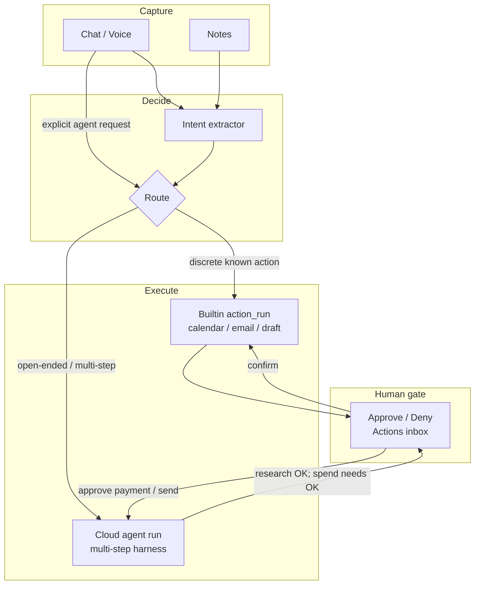
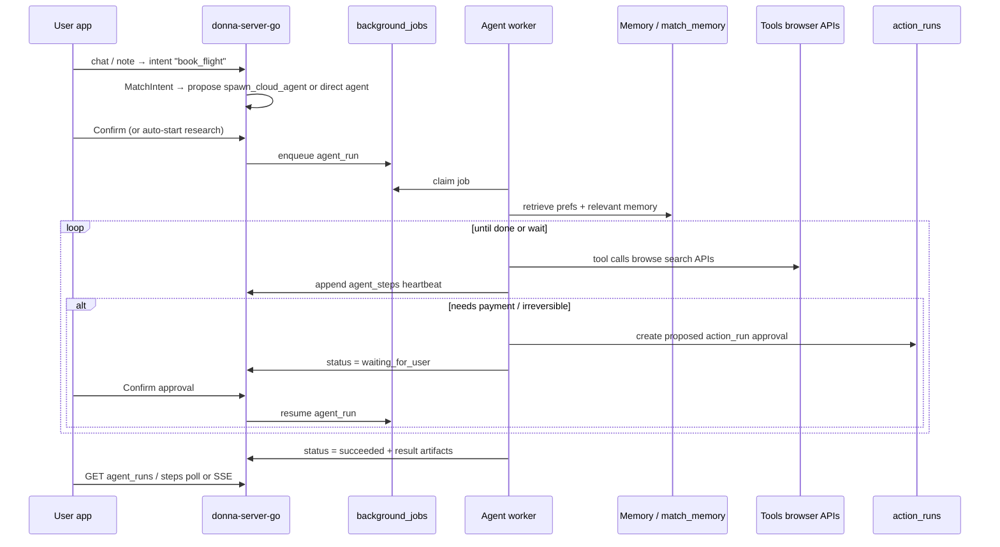

# Improvement Plan 2: Per-user Cloud Agent Harness

**Status:** Proposed  
**Pillar:** Act (memory → completed work)  
**Constraint:** Extend the existing Intent → Action → Confirm loop; do not replace chat or builtins  
**Target:** Long-running agents that work on cloud for every Donna user — book flights, find photos, research and execute — while the phone/laptop is closed. User only approves irreversible steps.

## Why this exists

Donna already has two execution paths:

| Path | Where | Lifetime | Good for |
|------|--------|----------|----------|
| **Chat harness** | Request-scoped tool loop (`pipeline/tools`, ~3 rounds / 45s) | Sync while user waits | Research answers, `fetch_url` / `browse_page` |
| **Intent → Action** | Extract → propose → confirm → builtin execute | Async proposal, sync execute on confirm | Calendar events, Gmail send, drafts, reminders |

Neither path covers the pitch use cases:

- “Book me a flight to SF next week using my usual preferences — I’ll just approve payment.”
- “Find that photo I described of the rooftop dinner in Lisbon.”
- Multi-step work that takes minutes, needs browser sessions, retries, and memory — **without keeping a device awake**.

Coding agents (Cursor Cloud, Hermes, Cowork) prove the harness pattern. Donna needs the **same shape for personal life**: a per-user cloud agent that is grounded in Donna memory, can use tools for a long time, and gates money/irreversible side effects on explicit approval.



## Product principles

1. **Laptop optional.** Agent runs on Donna’s cloud workers, not the user’s device.
2. **Memory first.** Every agent boots with the user’s preferences, people, travel habits, and relevant notes — not a blank chat.
3. **Propose early, spend late.** Research and draft freely; anything irreversible (pay, book, send, delete) waits for approval.
4. **One inbox.** Approvals reuse the existing Actions UX (`ActionsScreen` / `IntentsInboxPage`), not a second product surface.
5. **Observable.** User can watch progress, cancel, and see what the agent did (tool timeline + artifacts).
6. **Risk-tiered.** Prefer first-party APIs when connected; fall back to browser computer-use only when needed; never invent payment without a gate.

## Use cases (v1 framing)

### A. Transactional (flight / hotel / purchase)

1. User: “Book a flight to SFO next Thursday evening, back Sunday — aisle, under $600 if possible.”
2. Agent retrieves memory: home airport, preferred airlines, loyalty numbers, seat prefs, budget norms.
3. Agent searches options (API and/or browser), ranks against prefs, posts a **proposal card** (itinerary + price).
4. User taps **Approve** (or adjusts constraints). Agent completes booking / payment handoff.
5. Agent writes back: confirmation + calendar event via existing `create_calendar_event` path.

### B. Memory search (find that picture / note)

1. User: “Find the photo of the rooftop dinner in Lisbon — blue lights, maybe July.”
2. Agent queries `match_memory` + notes + attachments / future photo index; may ask one clarifying question via chat push.
3. Returns candidates with citations; no approval needed for read-only search.

### C. Background life ops (later)

Follow-ups, form fills, “keep checking until X,” inbox triage — same harness, different goals and tool allowlists.

---

## Architecture

### Core idea

Add a third runner beside `builtin` / future `http` / `llm_template`:

- **`agent`** — a long-running, tool-using loop owned by a `agent_runs` row, claimed by cloud workers.

Keep `action_runs` as the **approval ledger**. Agent runs *emit* action_runs (or nested approval steps) when they need user confirmation. Discrete builtins stay as today.

### Data model (new)

```sql
-- Per-user long-running agent execution
create table agent_runs (
  id uuid primary key default gen_random_uuid(),
  user_id uuid not null references auth.users(id) on delete cascade,
  intent_id uuid references intents(id) on delete set null,
  goal text not null,                    -- user-facing objective
  status text not null default 'queued'
    check (status in (
      'queued', 'running', 'waiting_for_user',
      'succeeded', 'failed', 'cancelled', 'expired'
    )),
  plan jsonb not null default '{}'::jsonb,
  memory_snapshot jsonb not null default '{}'::jsonb,  -- what was injected at start
  tool_allowlist text[] not null default '{}',
  max_steps int not null default 40,
  step_count int not null default 0,
  lease_owner text,
  lease_until timestamptz,
  last_heartbeat_at timestamptz,
  error text,
  result jsonb,
  created_at timestamptz not null default now(),
  updated_at timestamptz not null default now(),
  finished_at timestamptz
);

create table agent_steps (
  id uuid primary key default gen_random_uuid(),
  agent_run_id uuid not null references agent_runs(id) on delete cascade,
  seq int not null,
  kind text not null check (kind in (
    'thought', 'tool_call', 'tool_result',
    'memory_retrieve', 'approval_request',
    'user_message', 'status'
  )),
  payload jsonb not null default '{}'::jsonb,
  created_at timestamptz not null default now(),
  unique (agent_run_id, seq)
);

-- Link agent-requested approvals to existing action_runs
alter table action_runs
  add column if not exists agent_run_id uuid references agent_runs(id) on delete set null,
  add column if not exists approval_kind text;  -- e.g. 'book_flight', 'pay', 'send_email'
```

Extend `actions.runner` check to include `'agent'` (or keep agent spawning as a system action `spawn_cloud_agent` with runner `builtin` that enqueues an `agent_runs` row — prefer the latter for Phase 1 to avoid schema churn on `actions`).

**Phase 1 spawn path (recommended):** system action slug `spawn_cloud_agent` → on confirm (or auto for low-risk goals), enqueue `agent_runs` + background job `agent_run`.

### Runtime



Reuse existing `jobs.Worker` + `background_jobs` claim/lease (same pattern as memory extract, note index, ChatGPT import). Add handler `agent_run`.

**Worker process options:**

| Option | Pros | Cons | Recommendation |
|--------|------|------|----------------|
| Same Railway process as HTTP | Simple | Long agent loops compete with chat latency | OK for dogfood only |
| Separate `donna-agent-worker` service | Isolate CPU/browser; scale independently | Extra deploy | **Default for production** |
| Ephemeral pod per run (Cursor-style) | Strong isolation, browser state | Ops cost, cold start | Phase 3 if needed |

### Agent loop (harness)

Mirror chat’s `RunToolLoop`, but with agent-grade limits:

- Max steps (e.g. 40), wall clock (e.g. 15–30 min), cost budget.
- Tools registered from an **agent registry** (superset of chat tools).
- On each step: persist `agent_steps`, heartbeat lease, check cancel flag.
- On `request_approval` tool: create `action_runs` row (`status=proposed`), set agent `waiting_for_user`, exit worker cleanly; resume job on confirm.
- On success: write `result` (summary, links, booking refs, photo IDs) and optionally chain builtins (calendar).

Pseudo-structure in Go:

```
internal/agents/
  harness.go      // loop: plan → tool → observe → …
  tools/          // memory_search, browse, search_flights, request_approval, …
  spawner.go      // intent/chat → agent_runs
  resume.go       // approval confirmed → re-enqueue
  handler.go      // HTTP: list/get/cancel/stream steps
```

### Tool tiers

| Tier | Tools | When | Approval |
|------|-------|------|----------|
| **Read** | `memory_search`, `search_notes`, `fetch_url`, `browse_page` (read-only) | Always | None |
| **Connected write** | `create_calendar_event`, `send_email`, future `list_calendar` | Google connected | Existing risk model (`external` / `irreversible`) |
| **Commerce / book** | `search_flights`, `hold_itinerary`, `complete_booking` | Partner API or browser | Always for pay/book |
| **Computer use** | Playwright click/type/fill (extend `donna-browser`) | No API / login walls | Session credentials vaulted; book/pay still via approval |

Chat today already has `fetch_url` + optional `browse_page` via `DONNA_BROWSER_URL`. Agents should **reuse** that sidecar, with a longer-lived browser context per `agent_run_id` (cookies scoped to that run, destroyed on finish).

### Memory injection

At agent start:

1. Run `memory.PlanMemory(goal)` + `RetrieveMemory` (same path as chat augment).
2. Load profile identity facts, timezone, connected integration capabilities.
3. Persist a compact `memory_snapshot` on `agent_runs` for audit (“why did it pick United?”).
4. Mid-run: allow `memory_search` tool for follow-up retrieval (don’t stuff everything into the first prompt).

### Approval UX

Extend existing Actions inbox:

- New card type when `action_runs.agent_run_id` is set: show agent goal, proposal summary (itinerary/price/photo picks), Confirm / Deny / “Tell Donna…”.
- Agent detail sheet: live step timeline (poll `GET /agent-runs/{id}/steps` or SSE).
- Push / local notification when status → `waiting_for_user` or `succeeded`.

Do **not** invent a separate “Agents” tab until volume justifies it; nest under Actions + optional Chat status chips.

### Routing: when to spawn an agent vs builtin

| Signal | Path |
|--------|------|
| Intent kind maps to known slug (`schedule`, `send_email`, …) | Existing matcher → builtin `action_runs` |
| Kind is open-ended (`book_travel`, `find_media`, `research_and_act`) or slots incomplete | `spawn_cloud_agent` |
| User explicitly says “work on this in the background” | Force agent |
| Chat tool loop would exceed budget / needs browser login | Escalate mid-chat → agent (Phase 2) |

Extend `kindToActionSlug` and intent extractor prompt with agent kinds once the runner exists.

---

## Implementation phases

### Phase 0 — Spec + dogfood hooks (this doc)

- Agree on approval model and data tables.
- Feature flag `flag_cloud_agents`.
- No user-visible agent yet.

### Phase 1 — Skeleton harness (shippable vertical slice)

**Goal:** User can start a **read-only** agent (“find that note/photo description in my memory”) that runs async, shows steps, and returns results — laptop closed.

Deliverables:

1. Migration: `agent_runs`, `agent_steps`; optional `action_runs.agent_run_id`.
2. `internal/agents` package: enqueue, worker handler, step loop with tools:
   - `memory_search`
   - `search_notes` (reuse storage)
   - `fetch_url` (reuse chat tool)
3. APIs:
   - `POST /agent-runs` `{ goal }`
   - `GET /agent-runs`, `GET /agent-runs/{id}`, `GET /agent-runs/{id}/steps`
   - `POST /agent-runs/{id}/cancel`
4. Worker: job type `agent_run` on existing `jobs.Worker` (same process OK).
5. Web + iOS: minimal “Working…” row on Actions / Chat that opens step list.
6. Eval fixtures: 10 memory-search goals with expected note/fact IDs.

**Exit criteria:** From phone, start agent, lock phone, return later → result + citations. No payment.

### Phase 2 — Approval bridge + connected writes

1. Tool `request_approval` → creates `action_runs` proposed; agent → `waiting_for_user`.
2. On `ConfirmRun`, if `agent_run_id` set → resume agent with approval result in context (don’t only run builtin).
3. Allow agent to call calendar/email builtins **only after** approval (or reuse Confirm on nested runs).
4. Intent kinds: `find_media`, `research` → auto-spawn Phase 1 agents; `book_*` waits for Phase 3.

### Phase 3 — Transactional booking (flight slice)

1. Prefer a **flight search API** (partner) over raw browser for ranking; browser only to complete when API can’t book.
2. Proposal schema: flights, price, constraints matched from memory, deep link / hold id.
3. Approval card: “Approve $X booking”.
4. Post-success: create calendar event + store confirmation in notes/memory.
5. Hard rules: never store full card numbers in memory; payment via provider checkout / tokenized flow; audit log every tool call.

### Phase 4 — Computer-use depth + isolation

1. Extend `donna-browser` with click/type/screenshot/session APIs keyed by `agent_run_id`.
2. Optional dedicated agent-worker service + browser pool.
3. Credential vault for site logins (separate from Supabase session); user grants per-site.
4. Cost/latency SLOs and per-user concurrency limits (e.g. 1–2 active agents).

---

## API sketch

```http
POST /agent-runs
Authorization: Bearer <jwt>
{ "goal": "Find the Lisbon rooftop dinner photo", "intent_id": "..." }

→ { "id": "...", "status": "queued" }

GET /agent-runs/{id}/steps
→ [ { "seq": 1, "kind": "memory_retrieve", "payload": {...} },
    { "seq": 2, "kind": "tool_call", "payload": { "name": "memory_search", ... } },
    ... ]

POST /action-runs/{id}/confirm   # existing — if agent_run_id set, resumes agent
```

Chat can also expose a tool `start_cloud_agent` that creates a run and returns immediately with a status chip (Phase 2).

---

## Security & trust

- RLS on `agent_runs` / `agent_steps` by `user_id` (same as intents).
- Tool allowlist per run; commerce tools off until Phase 3 flag.
- Prompt injection: treat fetched page text as untrusted; never execute instructions found in web content that escalate privileges.
- Secrets: integration tokens stay in `integration_connections`; browser sessions ephemeral.
- Irreversible actions always go through `action_runs` confirm — agents cannot self-approve.
- Rate limit agent enqueues per user; max concurrent leases.

## Observability

- Structured logs: `agent_run_id`, step seq, tool name, latency, token/cost estimate.
- Metrics: queue lag, success rate, time-to-first-approval, time-to-complete.
- User-visible error codes (reuse integration retry patterns: `needs_integration:google`, etc.).

## What we explicitly do not build in v1

- Fully autonomous spending without approval.
- General “do anything on my laptop” RPA.
- Replacing the chat harness for short Q&A.
- Per-user always-on VM (Cursor-style env) — overkill until computer-use demands it; start with shared workers + browser sidecar.

---

## File / package map (expected)

| Area | Change |
|------|--------|
| `supabase/migrations/0023_agent_runs.sql` | Tables + RLS |
| `donna-server-go/internal/agents/` | Harness, tools, HTTP, resume |
| `donna-server-go/internal/jobs` + `cmd/server` | Register `agent_run` handler |
| `donna-server-go/internal/actions` | `spawn_cloud_agent` builtin; confirm resume hook |
| `donna-server-go/internal/intents` | New kinds + matcher routes |
| `donna-server-go/internal/pipeline/tools` | Share fetch/browse clients with agents |
| `donna-web` / `donna-app` | Actions cards + agent step UI |
| `evals/` | Agent memory-search + booking-proposal fixtures |

## Success metrics

| Metric | Target (dogfood → early users) |
|--------|--------------------------------|
| Agent completes read-only goal without device open | ≥ 90% on fixture set |
| Approval → resume works without re-explaining goal | 100% for gated runs |
| User trust: zero unauthorized sends/books | Hard invariant |
| p95 queue → first step | ≤ 5s |
| Flight proposal quality (prefs matched) | Subjective dogfood; then rubric |

## Recommended first build order

1. Schema + `agent_runs` worker no-op heartbeat.
2. Memory-search-only harness + APIs.
3. Wire Actions/Chat status UI.
4. `request_approval` + resume.
5. Flight search proposal (API) + approve card.
6. Browser complete-booking path behind flag.

---

## Open questions (resolve during Phase 1)

1. **Auto-start vs confirm-to-start** for research agents? Recommendation: auto-start read-only; confirm before any write/spend.
2. **Chat vs Actions** as primary progress surface? Recommendation: Chat chip + Actions inbox for approvals.
3. **Flight partner** — which API for v1 search? Defer vendor pick until Phase 3; harness should treat search as a swappable tool.
4. **Photo search** — notes/attachments only first, or external Google Photos later? Recommendation: Donna-stored attachments + note descriptions first.

## Bottom line

Donna already has memory, an approval inbox, background jobs, and a short chat tool loop. The missing piece is a **per-user cloud harness**: long-running `agent_runs` that use memory + tools asynchronously and pause on `action_runs` for anything irreversible. Ship read-only memory agents first, then approval resume, then transactional booking — same product loop as the pitch: remember, plan, act on cloud, user only approves.
