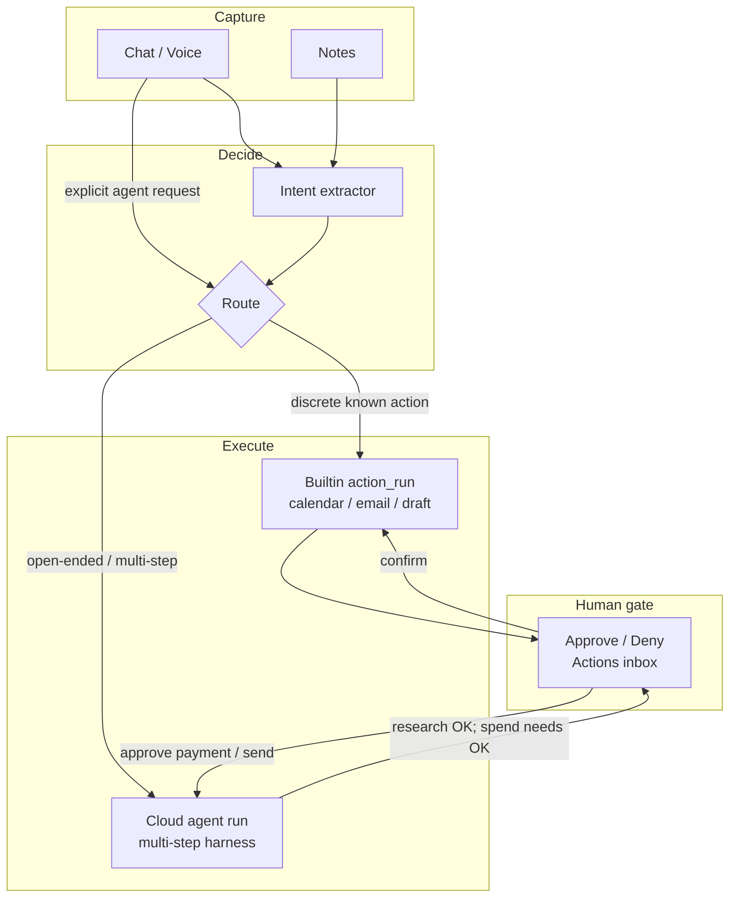
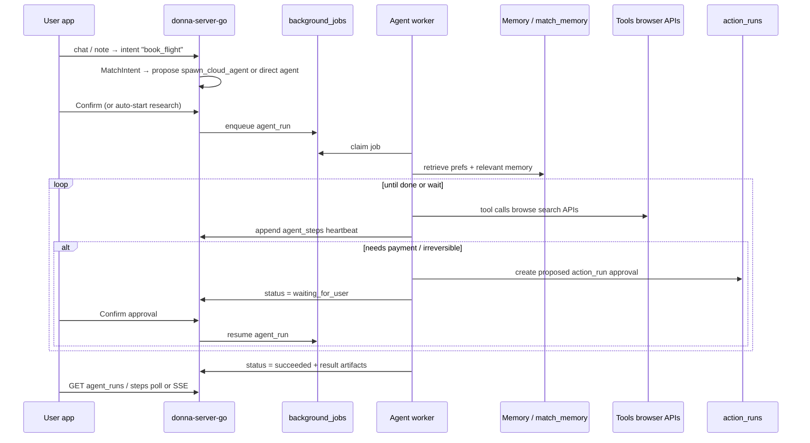

# Improvement Plan 2: Per-user Cloud Agent Harness

**Status:** Proposed  
**Pillar:** Act (memory → completed work)  
**Constraint:** Extend the existing Intent → Action → Confirm loop; do not replace chat or builtins  
**Quality bar:** Harness as good as [Hermes Agent](https://github.com/NousResearch/hermes-agent) (Nous Research) — then win on consumer UX + Donna memory + cloud-for-everyone  
**Target:** Long-running agents that work on cloud for every Donna user — book flights, find photos, research and execute — while the phone/laptop is closed. User only approves irreversible steps.

## Why this exists

Donna already has two execution paths:

| Path | Where | Lifetime | Good for |
|------|--------|----------|----------|
| **Chat harness** | Request-scoped tool loop (`pipeline/tools`, ~3 rounds / 45s) | Sync while user waits | Research answers, `fetch_url` / `browse_page` |
| **Intent → Action** | Extract → propose → confirm → builtin execute | Async proposal, sync execute on confirm | Calendar events, Gmail send, drafts, reminders |

Neither path covers the pitch use cases:

- “Book me a flight to SF next week using my usual preferences — I’ll just approve payment.”
- “Find that photo I described of the rooftop dinner in Lisbon.”
- Multi-step work that takes minutes, needs browser sessions, retries, and memory — **without keeping a device awake**.

Hermes proved what a serious personal-agent harness looks like for engineers (CLI + gateway + tools + skills + learning loop). Donna needs that **same harness craft** for personal life — not a watered-down 3-round chat loop rebranded as “agents.”

---

## Quality bar: as good as Hermes

The product differentiator vs Hermes is **who it’s for and where it runs** (phone/voice, non-engineers, cloud by default, transaction approvals). The **harness itself must not be weaker**.

### Match Hermes (non-negotiable harness craft)

| Hermes capability | Donna equivalent | Bar |
|-------------------|------------------|-----|
| Real agent loop (`AIAgent.run_conversation`) — not a toy round cap | `internal/agents` harness with high step budget, retries, provider fallback | Must |
| Self-registering tool registry + toolsets | Agent tool registry with named toolsets (`memory`, `web`, `browser`, `integrations`, `commerce`, `safe`) | Must |
| Observable tool execution (streaming / callbacks) | Persist every step; SSE/poll timeline; Chat “Working…” with live tool names | Must |
| Interruptible mid-flight | Cancel + **redirect** (“stop, try United instead”) without losing run identity | Must |
| Context compression for long runs | Mid-run compressor (keep head goal + tail + tool summary); stable system prompt for cache | Must |
| Dangerous-action approval | Existing `action_runs` confirm; agents cannot self-approve irreversible tools | Must |
| Session persistence + search | `agent_runs` / `agent_steps` + FTS on step payloads / goal; link to conversation | Must |
| Subagent delegation | Spawn child `agent_runs` for parallel workstreams (search flights ∥ check calendar) | Must (Phase 2) |
| Skills / procedural memory (`SKILL.md`, agentskills.io) | Per-user + system skills Donna learns (“how Kishan books flights”); progressive disclosure into prompt | Must (Phase 2–3) |
| Browser + web tool depth | Full browse: navigate / snapshot / click / type / vision — not read-only extract only | Must (Phase 2+) |
| Cron / unattended jobs | Scheduled agent goals (“every Monday brief”, “watch this price”) on cloud | Must (Phase 3) |
| Platform-agnostic core | One harness serves chat escalate, voice, Actions, cron, API — entry points differ, loop doesn’t | Must |
| Closed learning loop (skills from trajectories) | After complex successes/failures, distill or update skills; mine `agent_steps` | Should (Phase 3–4) |
| Terminal / code sandbox backends | Optional later for power users; **not** the consumer v1 surface | Later |

### Beat Hermes (Donna’s wedge)

| Dimension | Hermes | Donna |
|-----------|--------|-------|
| Primary UI | CLI / messenger gateway | Voice + iOS + web — no terminal required |
| Memory | Local files + session FTS + Honcho | Structured Donna memory (`match_memory`, facts, notes, integrations) already productized |
| Where it runs | Often user’s machine / VPS they operate | **Donna cloud by default** — phone locked is fine |
| Money / bookings | General tools; approval for dangerous shell | First-class **transaction approval cards** in Actions |
| Audience | Engineers comfortable with agents/CLI | Non-technical knowledge workers |

**Rule:** If a Hermes user would call our loop “toy” (no compression, no interrupt, silent failures, 3 tool rounds, no skills), we failed — even if flight booking demos look good.

### Anti-patterns (explicitly forbidden)

- Reusing chat’s `DefaultMaxRounds = 3` / `45s` budget for agent runs.
- Fire-and-forget jobs with no step log the user can open.
- “Agent” that is only an LLM prompt with no tool registry.
- Blocking the HTTP chat process on a 20-minute browser booking.
- Skills that only engineers can author (no path from successful runs → reusable procedure).



## Product principles

1. **Hermes-grade loop.** Compression, interrupt/redirect, rich tools, skills, subagents — craft first; demos second.
2. **Laptop optional.** Agent runs on Donna’s cloud workers, not the user’s device.
3. **Memory first.** Every agent boots with the user’s preferences, people, travel habits, and relevant notes — not a blank chat.
4. **Propose early, spend late.** Research and draft freely; anything irreversible (pay, book, send, delete) waits for approval.
5. **One inbox.** Approvals reuse the existing Actions UX (`ActionsScreen` / `IntentsInboxPage`), not a second product surface.
6. **Observable.** Every tool call is user-visible (Hermes design principle); cancel and redirect mid-flight.
7. **Risk-tiered.** Prefer first-party APIs when connected; fall back to browser computer-use only when needed; never invent payment without a gate.
8. **One core, many doors.** Same harness behind chat escalate, voice, Actions, cron — like Hermes’s single `AIAgent` behind CLI/gateway/ACP.

## Use cases (v1 framing)

### A. Transactional (flight / hotel / purchase)

1. User: “Book a flight to SFO next Thursday evening, back Sunday — aisle, under $600 if possible.”
2. Agent retrieves memory: home airport, preferred airlines, loyalty numbers, seat prefs, budget norms.
3. Agent searches options (API and/or browser), ranks against prefs, posts a **proposal card** (itinerary + price).
4. User taps **Approve** (or adjusts constraints). Agent completes booking / payment handoff.
5. Agent writes back: confirmation + calendar event via existing `create_calendar_event` path.

### B. Memory search (find that picture / note)

1. User: “Find the photo of the rooftop dinner in Lisbon — blue lights, maybe July.”
2. Agent queries `match_memory` + notes + attachments / future photo index; may ask one clarifying question via chat push.
3. Returns candidates with citations; no approval needed for read-only search.

### C. Background life ops (later)

Follow-ups, form fills, “keep checking until X,” inbox triage — same harness, different goals and tool allowlists.

---

## Architecture

### Core idea

Add a third runner beside `builtin` / future `http` / `llm_template`:

- **`agent`** — a long-running, tool-using loop owned by a `agent_runs` row, claimed by cloud workers.

Keep `action_runs` as the **approval ledger**. Agent runs *emit* action_runs (or nested approval steps) when they need user confirmation. Discrete builtins stay as today.

### Data model (new)

```sql
-- Per-user long-running agent execution
create table agent_runs (
  id uuid primary key default gen_random_uuid(),
  user_id uuid not null references auth.users(id) on delete cascade,
  intent_id uuid references intents(id) on delete set null,
  goal text not null,                    -- user-facing objective
  status text not null default 'queued'
    check (status in (
      'queued', 'running', 'waiting_for_user',
      'succeeded', 'failed', 'cancelled', 'expired'
    )),
  plan jsonb not null default '{}'::jsonb,
  memory_snapshot jsonb not null default '{}'::jsonb,  -- what was injected at start
  tool_allowlist text[] not null default '{}',
  max_steps int not null default 40,
  step_count int not null default 0,
  lease_owner text,
  lease_until timestamptz,
  last_heartbeat_at timestamptz,
  error text,
  result jsonb,
  created_at timestamptz not null default now(),
  updated_at timestamptz not null default now(),
  finished_at timestamptz
);

create table agent_steps (
  id uuid primary key default gen_random_uuid(),
  agent_run_id uuid not null references agent_runs(id) on delete cascade,
  seq int not null,
  kind text not null check (kind in (
    'thought', 'tool_call', 'tool_result',
    'memory_retrieve', 'approval_request',
    'user_message', 'status'
  )),
  payload jsonb not null default '{}'::jsonb,
  created_at timestamptz not null default now(),
  unique (agent_run_id, seq)
);

-- Link agent-requested approvals to existing action_runs
alter table action_runs
  add column if not exists agent_run_id uuid references agent_runs(id) on delete set null,
  add column if not exists approval_kind text;  -- e.g. 'book_flight', 'pay', 'send_email'
```

Extend `actions.runner` check to include `'agent'` (or keep agent spawning as a system action `spawn_cloud_agent` with runner `builtin` that enqueues an `agent_runs` row — prefer the latter for Phase 1 to avoid schema churn on `actions`).

**Phase 1 spawn path (recommended):** system action slug `spawn_cloud_agent` → on confirm (or auto for low-risk goals), enqueue `agent_runs` + background job `agent_run`.

### Runtime



Reuse existing `jobs.Worker` + `background_jobs` claim/lease (same pattern as memory extract, note index, ChatGPT import). Add handler `agent_run`.

**Worker process options:**

| Option | Pros | Cons | Recommendation |
|--------|------|------|----------------|
| Same Railway process as HTTP | Simple | Long agent loops compete with chat latency | OK for dogfood only |
| Separate `donna-agent-worker` service | Isolate CPU/browser; scale independently | Extra deploy | **Default for production** |
| Ephemeral pod per run (Cursor-style) | Strong isolation, browser state | Ops cost, cold start | Phase 3 if needed |

### Agent loop (harness) — Hermes-shaped

Do **not** fork chat’s `RunToolLoop` limits. Build a dedicated loop closer to Hermes’s `AIAgent`:

| Concern | Requirement |
|---------|-------------|
| Step budget | High (e.g. 80–200 steps) + wall clock + $ cost budget; stop cleanly with partial result |
| Tool registry | Self-registering tools grouped into toolsets; allowlist per run / risk tier |
| Persistence | Every thought/tool/result → `agent_steps` before next model call |
| Heartbeat / lease | Worker renews lease; crashed workers lose lease; another worker resumes from last step |
| Interrupt | `cancel` stops in-flight tool when possible; `redirect` injects user message and continues |
| Approval pause | `request_approval` → `action_runs` proposed → status `waiting_for_user` → clean exit → resume on confirm |
| Context | Stable system prompt (identity + tool guidance + active skills); compress middle turns when near context limit |
| Retries | Tool errors returned to the model; provider/timeouts with backoff; no silent drop |
| Subagents | `delegate_task` spawns child `agent_runs`; parent waits or continues; results merge into parent context |
| Skills | Load matching `SKILL.md`-style procedures into prompt (progressive disclosure); write-back after hard wins |
| Todo / plan | Lightweight plan tool (Hermes `todo`) so long goals stay coherent across compressions |

Pseudo-structure in Go:

```
internal/agents/
  harness.go         // AIAgent-equivalent: prompt → model → tools → compress → …
  context.go         // stable prompt tiers + compressor
  registry.go        // toolsets + allowlists
  tools/             // one file per tool; self-register
  skills/            // load / match / distill skills
  subagent.go        // delegate_task → child agent_runs
  spawner.go         // intent/chat/cron → agent_runs
  resume.go          // approval / redirect → re-enqueue
  handler.go         // HTTP: list/get/cancel/redirect/stream
```

### Tool tiers (toolsets)

| Toolset | Tools | When | Approval |
|---------|-------|------|----------|
| **memory** | `memory_search`, `search_notes`, `session_search` | Always | None |
| **web** | `web_search`, `fetch_url` / `web_extract` | Always | None |
| **browser** | navigate, snapshot, click, type, vision (extend `donna-browser`) | Agent runs | None for read; write/login gated |
| **integrations** | calendar/email list+write | Google connected | Existing risk model |
| **commerce** | `search_flights`, `hold_itinerary`, `complete_booking` | Flag + partner | Always for pay/book |
| **orchestration** | `todo`, `clarify`, `request_approval`, `delegate_task` | Always | Approval tool only creates proposals |
| **skills** | `load_skill`, `save_skill` | Flag | save_skill may be auto for internal |

Chat today has `fetch_url` + optional read-only `browse_page` via `DONNA_BROWSER_URL`. Agents need a **deeper browser backend** (Hermes-level interactivity), with a longer-lived context per `agent_run_id` (cookies scoped to that run, destroyed on finish).

### Memory injection

At agent start (and after compressions):

1. Run `memory.PlanMemory(goal)` + `RetrieveMemory` (same path as chat augment).
2. Load profile identity facts, timezone, connected integration capabilities.
3. Load matching skills (travel booking, photo search, …).
4. Persist a compact `memory_snapshot` on `agent_runs` for audit (“why did it pick United?”).
5. Mid-run: `memory_search` + `session_search` tools — don’t stuff everything into the first prompt (Hermes progressive disclosure).

### Approval UX

Extend existing Actions inbox:

- New card type when `action_runs.agent_run_id` is set: show agent goal, proposal summary (itinerary/price/photo picks), Confirm / Deny / “Tell Donna…”.
- Agent detail sheet: live step timeline (poll `GET /agent-runs/{id}/steps` or SSE).
- Push / local notification when status → `waiting_for_user` or `succeeded`.

Do **not** invent a separate “Agents” tab until volume justifies it; nest under Actions + optional Chat status chips.

### Routing: when to spawn an agent vs builtin

| Signal | Path |
|--------|------|
| Intent kind maps to known slug (`schedule`, `send_email`, …) | Existing matcher → builtin `action_runs` |
| Kind is open-ended (`book_travel`, `find_media`, `research_and_act`) or slots incomplete | `spawn_cloud_agent` |
| User explicitly says “work on this in the background” | Force agent |
| Chat tool loop would exceed budget / needs browser login | Escalate mid-chat → agent (Phase 2) |

Extend `kindToActionSlug` and intent extractor prompt with agent kinds once the runner exists.

---

## Implementation phases

Phases are ordered so **harness craft lands before vertical demos**. A pretty flight booking on a weak loop is a regression vs Hermes.

### Phase 0 — Spec + dogfood hooks (this doc)

- Agree on Hermes quality bar + approval model + data tables.
- Feature flag `flag_cloud_agents`.
- No user-visible agent yet.

### Phase 1 — Hermes-grade core loop (read-only dogfood)

**Goal:** A real agent runtime users can trust — not a skeleton. Read-only first so we harden the loop without money risk.

Deliverables:

1. Migration: `agent_runs`, `agent_steps`; `action_runs.agent_run_id` nullable.
2. `internal/agents` harness with:
   - High step / time / cost budgets (not chat’s 3×45s)
   - Self-registering tools + toolsets (`memory`, `web`)
   - Step persistence + heartbeat/lease resume
   - Cancel **and** redirect APIs
   - Context compressor when near model limit
   - `todo` plan tool
3. Tools: `memory_search`, `search_notes`, `web_search` or `fetch_url`, `session_search` (agent history)
4. APIs:
   - `POST /agent-runs` `{ goal }`
   - `GET /agent-runs`, `GET /agent-runs/{id}`, `GET /agent-runs/{id}/steps` (SSE preferred)
   - `POST /agent-runs/{id}/cancel`
   - `POST /agent-runs/{id}/redirect` `{ message }`
5. Dedicated worker path acceptable in-process for dogfood; plan `donna-agent-worker` split.
6. Web + iOS: live tool timeline (“Working… searched memory → fetched …”).
7. Eval fixtures: ≥20 memory/web goals; assert step logs exist, cancel works, redirect continues, compression keeps goal.

**Exit criteria:** Phone-locked multi-minute run completes with full step audit; cancel/redirect feel as responsive as Hermes interrupt; no silent tool failures.

### Phase 2 — Approvals, browser depth, subagents, skills

1. `request_approval` → `action_runs` proposed → `waiting_for_user` → resume on confirm with result in context.
2. Browser toolset to Hermes-like depth (navigate / snapshot / click / type / vision) on `donna-browser`, session per `agent_run_id`.
3. `delegate_task` child agents for parallel workstreams.
4. Skills store (system + per-user); load on match; optional save after successful complex runs.
5. Connected writes (calendar/email) only through approval bridge.
6. Intent kinds: `find_media`, `research` auto-spawn; chat escalate when short tool loop is insufficient.

### Phase 3 — Transactional booking + cron

1. Flight search API toolset + proposal card + pay/book approval.
2. Post-success: calendar + memory write-back; distill a “booking prefs/procedure” skill when useful.
3. Cron / scheduled agent goals (Hermes cron analogue) delivering to push/chat.
4. Hard rules: no raw card storage; tokenized checkout; full tool audit.

### Phase 4 — Learning loop + isolation

1. Trajectory mining → skill distillation / GEPA-like improvement offline (Hermes closed loop analogue).
2. Dedicated agent-worker + browser pool; per-user concurrency limits.
3. Credential vault for site logins; optional sandboxed code-exec for power users.
4. SLOs: queue lag, success, cost per successful goal, unauthorized-action rate = 0.

---

## API sketch

```http
POST /agent-runs
Authorization: Bearer <jwt>
{ "goal": "Find the Lisbon rooftop dinner photo", "intent_id": "..." }

→ { "id": "...", "status": "queued" }

GET /agent-runs/{id}/steps          # or text/event-stream
→ [ { "seq": 1, "kind": "memory_retrieve", "payload": {...} },
    { "seq": 2, "kind": "tool_call", "payload": { "name": "memory_search", ... } },
    ... ]

POST /agent-runs/{id}/cancel
POST /agent-runs/{id}/redirect
{ "message": "Prefer United, aisle seat" }

POST /action-runs/{id}/confirm   # existing — if agent_run_id set, resumes agent
```

Chat can also expose a tool `start_cloud_agent` that creates a run and returns immediately with a status chip (Phase 2).

---

## Security & trust

- RLS on `agent_runs` / `agent_steps` by `user_id` (same as intents).
- Tool allowlist per run; commerce tools off until Phase 3 flag.
- Prompt injection: treat fetched page text as untrusted; never execute instructions found in web content that escalate privileges.
- Secrets: integration tokens stay in `integration_connections`; browser sessions ephemeral.
- Irreversible actions always go through `action_runs` confirm — agents cannot self-approve.
- Rate limit agent enqueues per user; max concurrent leases.

## Observability

- Structured logs: `agent_run_id`, step seq, tool name, latency, token/cost estimate.
- Metrics: queue lag, success rate, time-to-first-approval, time-to-complete.
- User-visible error codes (reuse integration retry patterns: `needs_integration:google`, etc.).

## What we explicitly do not build in v1

- Fully autonomous spending without approval.
- A CLI-first Hermes clone (we want Hermes **craft**, not Hermes UX).
- Replacing the chat harness for short Q&A (chat stays fast; agents escalate).
- Shipping flight booking before cancel/redirect/compression/step audit exist.
- Per-user always-on VM on day one — shared workers + browser sidecar first; isolate when computer-use demands it.

---

## File / package map (expected)

| Area | Change |
|------|--------|
| `supabase/migrations/0023_agent_runs.sql` | Tables + RLS (+ skills table in Phase 2) |
| `donna-server-go/internal/agents/` | Harness, context compressor, registry, tools, skills, subagents, HTTP |
| `donna-server-go/internal/jobs` + `cmd/server` | Register `agent_run` handler; later split worker binary |
| `donna-server-go/internal/actions` | `spawn_cloud_agent`; confirm resume hook |
| `donna-server-go/internal/intents` | New kinds + matcher routes |
| `donna-server-go/internal/pipeline/tools` | Share clients; do **not** inherit chat round caps |
| `donna-browser` | Interactive computer-use APIs (Phase 2) |
| `donna-web` / `donna-app` | Live timeline, redirect, approval cards |
| `evals/` | Harness reliability fixtures + booking-proposal fixtures |

## Success metrics

| Metric | Target |
|--------|--------|
| Harness parity sniff test vs Hermes | Dogfood: multi-minute run, interrupt, redirect, visible tools, no silent fail |
| Agent completes read-only goal without device open | ≥ 90% on fixture set |
| Cancel stops further tool calls | ≤ 2s after ACK (best-effort on in-flight HTTP) |
| Redirect continues same `agent_run_id` | 100% |
| Approval → resume without re-explaining goal | 100% for gated runs |
| Unauthorized sends/books | **0** (hard invariant) |
| p95 queue → first step | ≤ 5s |
| Flight proposal quality (prefs matched) | Rubric after Phase 3 |

## Recommended first build order

1. Schema + lease/heartbeat + step log.
2. Real harness loop (budgets, registry, compressor, todo) — **before** fancy verticals.
3. Memory + web tools + cancel/redirect + live UI timeline.
4. Approval bridge + interactive browser + subagents + skills.
5. Flight search proposal + approve card.
6. Cron + learning/distill loop.

---

## Open questions (resolve during Phase 1)

1. **Auto-start vs confirm-to-start** for research agents? Recommendation: auto-start read-only; confirm before any write/spend.
2. **Chat vs Actions** as primary progress surface? Recommendation: Chat chip with live tools + Actions inbox for approvals (Hermes: observable everywhere).
3. **Flight partner** — which API for v1 search? Defer vendor pick until Phase 3; harness treats search as a swappable tool.
4. **Photo search** — notes/attachments only first, or external Google Photos later? Recommendation: Donna-stored attachments + note descriptions first.
5. **Skills format** — adopt agentskills.io / Hermes `SKILL.md` verbatim for portability, or Donna-native JSON? Recommendation: Markdown skills compatible with agentskills.io so we can import/export later.
6. **Worker isolation timing** — when to split `donna-agent-worker`? Recommendation: as soon as browser sessions exist (Phase 2), not after booking demos.

## Bottom line

Donna’s agents must run on **cloud for every user** and feel consumer-simple — but the **harness craft has to be Hermes-class**: real loop, compression, interrupt/redirect, rich tools, skills, subagents, observable steps, approval for danger. Build that loop first (read-only dogfood), then approvals and booking. A weak harness with a flight demo loses to Hermes; a Hermes-grade harness with Donna memory and phone UX is the product.
