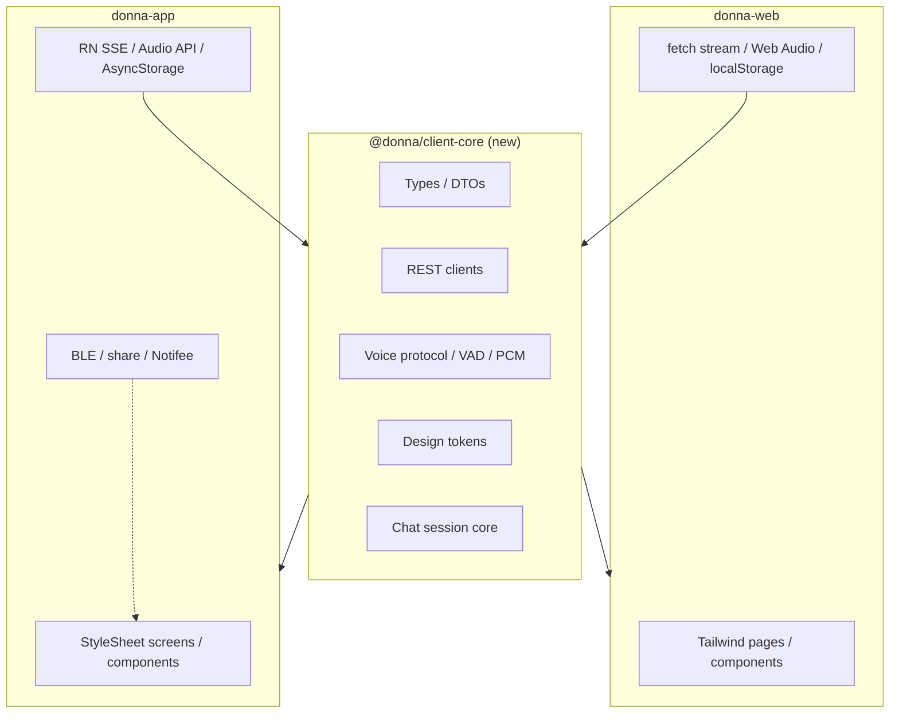

# Improvement Plan 2: Shared Client Code (App ↔ Web)

**Status:** Proposed  
**Pillar:** Feature / UI parity without double work  
**Constraint:** Keep shipping; no big-bang rewrite  
**Target:** One source of truth for product logic + design tokens; thin platform shells for RN and web

## Goal

Donna’s product surface is ~80% the same on iOS (`donna-app`, React Native) and web (`donna-web`, Vite + React). Today that means writing and drifting the same APIs, voice protocol, types, and theme tokens in two git submodules. This plan makes **shared TypeScript** the default for anything that isn’t platform UI or native APIs, so feature parity stops being a manual chase.



## Current state (why it hurts)

| Layer | Reality today |
|-------|----------------|
| Repos | Three submodules under `donna/` — no npm workspace, no shared package |
| Features | Chat, voice, auth, notes, memory, profile, ingest, themes on **both** |
| Duplicated TS | `services/*Api`, `voice/{protocol,vad,pcm,voiceClient,voiceErrors}`, `types/*`, `thinkingPhrases`, theme palettes |
| Already drifting | Web has `web_search` + richer citations; notes helpers differ; `authorizedFetch` reimplemented in web services |
| UI | Parallel product, **not** shareable as components (RN `StyleSheet` vs Tailwind DOM) |
| App-only (keep out of shared) | BLE device, captures queue, share extension, Notifee briefing |

Representative twins:

- [`donna-app/src/services/memoryApi.ts`](../../donna-app/src/services/memoryApi.ts) ↔ [`donna-web/src/services/memoryApi.ts`](../../donna-web/src/services/memoryApi.ts)
- [`donna-app/src/voice/protocol.ts`](../../donna-app/src/voice/protocol.ts) ↔ [`donna-web/src/voice/protocol.ts`](../../donna-web/src/voice/protocol.ts)
- [`donna-app/src/theme/colors.ts`](../../donna-app/src/theme/colors.ts) ↔ [`donna-web/src/app-shell.css`](../../donna-web/src/app-shell.css) (`--color-donna-*`)

## What we will **not** do first

These tools solve “one UI codebase,” but they’re a rewrite relative to bare RN + Vite SPA:

| Approach | Why defer |
|----------|-----------|
| React Native Web / Expo universal | Replaces Vite web shell; large migration |
| Tamagui / NativeWind / Solito | New design system + routing model |
| Ionic / Capacitor wrap of web | Wrong fit for existing native BLE / audio / share |

**Parity of look** comes from **shared tokens + checklist**, not from forcing one component tree. **Parity of behavior** comes from **shared core**.

---

## Recommended tool stack

| Need | Tool | Role |
|------|------|------|
| Package layout | **npm workspaces** in parent `donna` (optional later: Turborepo) | Hoist deps; `workspace:*` linking |
| Shared code | New package **`@donna/client-core`** | Pure TS: types, API, voice pure, tokens, chat core |
| Design tokens | Same package (`tokens.ts` + small codegen script) | One palette → RN objects + CSS variables |
| Tests | Vitest (or Jest) **inside** `@donna/client-core` | Catch drift once |
| Optional later | Storybook (web) + RN Storybook | Visual QA for shells, not shared UI |
| Optional later | Playwright smoke vs Maestro/Detox | Same user flows on both clients |

No paid SaaS required to start. Chromatic/Percy only if visual regression becomes painful.

---

## Repo layout decision

Submodules make sharing awkward. Pick **one** path and stick to it:

### Option A — Shared package **inside** the parent monorepo (recommended)

```
donna/
  packages/
    client-core/          # @donna/client-core
  donna-app/              # submodule OR inlined later
  donna-web/
  donna-server-go/
```

- Parent `package.json` becomes `"workspaces": ["packages/*", "donna-web", "donna-app"]` (app may need Metro `watchFolders` / `extraNodeModules` for the workspace package).
- Both clients depend on `"@donna/client-core": "workspace:*"`.
- **Pros:** One PR can change shared + both consumers; matches “write once.”  
- **Cons:** Submodule workflow gets noisier until app/web are inlined or always developed from the parent.

### Option B — Publish `@donna/client-core` as its own repo / private npm

- **Pros:** Keeps submodule autonomy.  
- **Cons:** Version bump tax; parity still lags unless both bump in lockstep.

**Recommendation:** Option A. If submodule friction bites, fold `donna-web` (and later `donna-app`) into the parent tree in a follow-up — don’t block Phase 1 on that.

---

## Phased plan

### Phase 0 — Rules of engagement (no code move yet)

Document and enforce:

1. **New product logic goes in shared first** (API shapes, parsers, constants, session state). Platform files only adapt I/O.
2. **UI stays forked** until tokens are shared; matching look = same tokens + same copy strings from shared.
3. **Feature checklist** in this doc (below): every user-facing capability lists App / Web / Shared owner.
4. Before merging a feature that touches both clients, the PR must update **shared** or explicitly justify a platform-only exception (BLE, share, landing).

**Done when:** This plan is accepted; contributors know where new code goes.

---

### Phase 1 — Extract `@donna/client-core` (highest ROI)

Create `packages/client-core` with **pure TypeScript only** (no React, no RN, no DOM).

| Move from both clients | Notes |
|------------------------|--------|
| `types/mode.ts`, `types/citations.ts` | Unify citation fields (`url`/`title`) |
| `lib/thinkingPhrases.ts` | Identical copy |
| `voice/protocol.ts`, `vad.ts`, core `pcm.ts`, `voiceErrors.ts` | Keep `playback` / capture platform-local |
| `services/memoryApi.ts`, `conversationsApi.ts` | Near line-for-line today |
| Shared pieces of `notesApi`, `knowledgeApi`, `accountApi` | Inject `fetch` + `getAccessToken` + `baseUrl` + `clientHeader` |
| Design **token values** | `indigo` / `eink` hex map |

**API design pattern** (dependency injection, not globals):

```ts
// packages/client-core/src/http.ts
export type DonnaHttp = {
  apiBaseUrl: string;
  getAccessToken: () => Promise<string | null>;
  fetch?: typeof fetch;
  clientHeader?: string; // "ios" | "web"
};

export function createMemoryApi(http: DonnaHttp) { /* ... */ }
```

Each app constructs the client once in its own `services/` thin wrapper.

**Metro (app):** add `watchFolders` to include `packages/client-core`; ensure package `"main"`/`"exports"` point at `src` or a built `dist`. Prefer **TypeScript source consumption** via Vite + Metro transpile for fewer publish steps.

**Done when:** Both app and web import memory + conversations + types + thinking phrases from `@donna/client-core`; duplicate files deleted; core unit tests pass.

---

### Phase 2 — Align drift + single HTTP + voice client

1. One `authorizedFetch` / JSON error helper in core (replace web’s per-file copies and app’s `http.ts` duplication of concerns).
2. Align chat request types: support `webSearch` on both (app can pass `false` / omit UI until shipped).
3. Shared citation / SSE event parsers used by both chat transports.
4. Lift isomorphic `VoiceClient` (WebSocket + protocol) into core; keep `AudioRecorder` / `BrowserAudioCapture` / `playback.ts` as adapters implementing a small interface:

```ts
export type VoiceAudioPort = {
  startCapture: (onPcm: (frame: Int16Array) => void) => Promise<void>;
  stopCapture: () => Promise<void>;
  enqueuePlayback: (pcm: Int16Array) => void;
  stopPlayback: () => void;
};
```

5. Generate or hand-sync **CSS variables** from `tokens.ts` (script: `node packages/client-core/scripts/emit-css.mjs` → `donna-web/src/generated-tokens.css`). App imports the TS object directly.

**Done when:** Chat event parsing and voice protocol live once; theme hex values cannot diverge without changing one file.

---

### Phase 3 — Shared session cores (behavior parity)

Extract platform-agnostic state machines (still no UI):

| Core module | Today | After |
|-------------|--------|--------|
| `createChatSession` / hook-agnostic store | Web: `useChatSession.ts`; App: logic inside `ChatScreen.tsx` | Shared reducer/effects; UI calls `send`, `abort`, `resume` |
| `createVoiceSession` | Both `useVoiceSession.ts` | Shared; inject `VoiceAudioPort` + `VoiceClient` |
| Attachment limits / validation | `chatAttachments` twins | Shared asserts; platform pickers only |

React hooks (`useChatSession`, `useVoiceSession`) become **thin** wrappers in each app that bind core to React state.

**Done when:** Editing a chat bugfix (streaming edge case, history resume) is one change in core + verified on both clients.

---

### Phase 4 — UI parity without shared components

Keep separate UIs; make them **look the same by construction**:

1. **Token contract** — every color/spacing/type size used in product chrome comes from shared tokens (web via CSS vars / Tailwind `@theme`; app via `ThemeColors`).
2. **Copy contract** — empty states, quick actions (“What do you remember?”, “Catch me up”, …), error strings live in `@donna/client-core/copy`.
3. **Parity checklist** (maintain in this file or `docs/parity.md`):

| Capability | Web | App | Shared owner |
|------------|-----|-----|--------------|
| Chat stream + history | ✓ | ✓ | client-core chat + conversationsApi |
| Web search toggle | ✓ | □ | client-core chat types; app UI follow-up |
| Voice turn | ✓ | ✓ | client-core voice |
| Notes CRUD / tags | ✓ | ✓ | client-core notesApi |
| Memory facts | ✓ | ✓ | client-core memoryApi |
| Theme indigo / e-ink | ✓ | ✓ | client-core tokens |
| Landing / marketing | ✓ | — | web only |
| BLE / captures / share | — | ✓ | app only |

4. Optional: screenshot fixtures for Chat / Notes / Memory / Profile in both themes for manual or Storybook review.

**Done when:** Shipping a visual change means editing tokens or copy once; checklist shows known gaps (e.g. web search on app) explicitly.

---

### Phase 5 — Optional “universal UI” rethink (only if still painful)

Revisit Tamagui / RN Web / Expo Router **only if** Phase 1–4 leave UI churn as the dominant cost. By then the shared core makes a UI migration safer. Do not start here.

---

## Implementation sketch (Phase 1 PR sequence)

1. **Parent repo:** add workspaces + `packages/client-core` with `package.json`, `tsconfig`, `src/index.ts`.
2. **Move** identical modules; re-export from old paths temporarily (`export * from '@donna/client-core'`) to keep diffs small.
3. **Wire** Vite `resolve.dedupe` / optimizeDeps and Metro `watchFolders`.
4. **Delete** duplicates after both compile.
5. **Add** vitest for memoryApi URL building + protocol encode/decode + token snapshot.
6. Follow-up PRs per Phase 2–3 modules (chat stream, voice, notes).

## Risks and mitigations

| Risk | Mitigation |
|------|------------|
| Metro can’t resolve workspace package | Explicit `watchFolders` + `nodeModulesPaths`; avoid `"type": "module"`-only pitfalls |
| Submodule PRs vs parent PRs | Prefer parent-first PRs that bump submodule SHAs together; or develop from parent with both checked out |
| Over-sharing React components | Hard rule: core stays React-free until Phase 5 decision |
| Big-bang stall | Ship Phase 1 with 2–3 modules only (memory + types + phrases) as the first merge |

## Success metrics

- Lines of duplicated `services/` + `voice/` pure TS drop by ≥50% after Phase 2.
- New API endpoint: **one** client implementation in core, two one-line wire-ups.
- Theme color change: **one** edit; both clients update.
- Feature parity tracked in checklist; accidental web-only/app-only product gaps are deliberate and listed.

## Out of scope

- Redesigning landing marketing typography to match app shell.
- Sharing BLE / share-extension / Notifee code with web.
- Replacing Vite or RN CLI in Phase 1–3.
