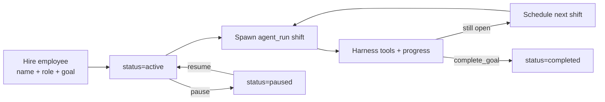

# Improvement Plan 3: Goal-driven AI Employees

**Status:** Phase 1 shipping  
**Pillar:** Act (persistent work toward outcomes)  
**Constraint:** Build on the existing cloud agent harness (`agent_runs`); do not invent a second loop  
**Target:** Users hire AI employees that keep working toward a goal in the background — phone locked is fine.

## Why this exists

Donna already has **episodic** cloud agents: one `agent_run` pursues a goal until it succeeds, fails, waits, or is cancelled.

That is the right unit of execution. It is the wrong product metaphor for ongoing work like:

- “Keep researching YC competitors and update my notes weekly.”
- “Find networking intros until I have three warm leads.”
- “Watch this topic and brief me when something material changes.”

**AI employees** are the durable identity + goal. Each **shift** is still an `agent_run`. The employee keeps getting shifts until the goal is achieved, the user pauses them, or they are archived.



## Product principles

1. **Employee ≠ run.** The employee owns the goal; runs are shifts.
2. **Same harness.** Shifts use `internal/agents` — compression, cancel/redirect, approvals, tools.
3. **Progress is first-class.** Employees accumulate a `progress_summary` the next shift reads.
4. **Continuous by default.** Cadence `0` means enqueue the next shift when the previous one finishes (small cooldown). Non-zero cadence wakes on a schedule.
5. **Human control.** Pause / resume / update goal / archive. Irreversible actions still go through Actions.

## Data model

```sql
create table ai_employees (
  id uuid primary key,
  user_id uuid not null references auth.users(id),
  name text not null,                 -- "Alex"
  role text not null default '',      -- "Researcher"
  goal text not null,                 -- ongoing objective
  status text not null default 'active'
    check (status in ('active','paused','completed','archived')),
  cadence_minutes int not null default 0,  -- 0 = continuous
  max_steps_per_shift int not null default 40,
  tool_allowlist text[] not null default '{}',
  progress_summary text not null default '',
  progress jsonb not null default '{}',
  current_agent_run_id uuid references agent_runs(id),
  shift_count int not null default 0,
  last_shift_at timestamptz,
  next_shift_at timestamptz,
  created_at timestamptz not null default now(),
  updated_at timestamptz not null default now(),
  completed_at timestamptz
);

alter table agent_runs
  add column employee_id uuid references ai_employees(id);
```

## Runtime

| Piece | Role |
|-------|------|
| `POST /employees` | Hire → `status=active`, `next_shift_at=now`, start first shift |
| `employees.Scheduler` | Tick: claim due active employees → spawn shift |
| `agents.Spawner` | Creates `agent_runs` with `employee_id` + shift brief as goal |
| Shift tools | `report_progress`, `complete_goal` |
| `AfterAgentRun` | On terminal shift: clear `current_agent_run_id`, update progress from result, schedule next or mark completed |

Shift brief (injected as the run goal):

```text
You are {name}, Donna AI employee ({role}).
Ongoing goal: {goal}
Progress so far: {progress_summary or "none yet"}
This is shift #{n}. Make concrete progress. Call report_progress before you wrap up.
Call complete_goal only when the ongoing goal is fully achieved.
```

## APIs

```http
POST   /employees
GET    /employees?status=
GET    /employees/{id}
PATCH  /employees/{id}
POST   /employees/{id}/pause
POST   /employees/{id}/resume
POST   /employees/{id}/archive
GET    /employees/{id}/runs
```

Feature flag: same gate as cloud agents (`DONNA_CLOUD_AGENTS`).

## UX

- **Web:** `/app/employees` — hire, see who’s working, pause/resume, open current/latest shift in Agent mode.
- **iOS:** Employees screen reachable from Profile (parity list + hire).
- **Nav:** Sidebar “Employees”; Profile link alongside Skills.

## Phases

### Phase 1 (this PR)

- Migration + store + HTTP API
- Scheduler + shift spawn + after-run reschedule
- `report_progress` / `complete_goal` tools
- Web Employees page + iOS list/hire surface
- Unit tests for store framing + shift lifecycle helpers

### Phase 2

- Push when employee completes or needs approval
- Employee detail with live shift timeline (reuse AgentTurnView)
- Hire from chat (“hire someone to…”)
- Per-employee skill allowlists

### Phase 3

- Event-driven wakes (new note, email, calendar) not only cadence
- Team of employees with handoff
- Cost/budget caps per employee

## Exit criteria (Phase 1)

- Hire an employee with a research goal; with phone locked, ≥2 shifts run and `progress_summary` grows.
- `complete_goal` marks employee completed and stops further shifts.
- Pause prevents new shifts; resume schedules the next one.
- Existing one-shot `/agent-runs` behavior unchanged when `employee_id` is null.
