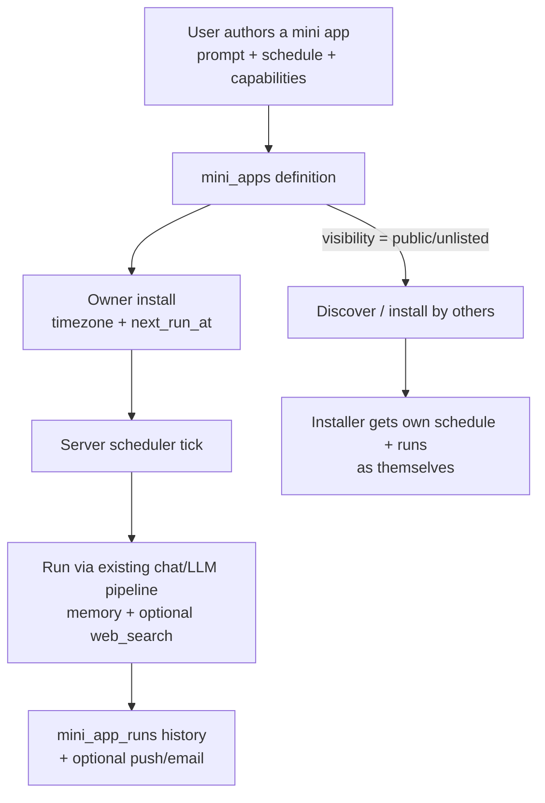

# Improvement Plan 3: User-Launched Mini Apps

**Status:** Proposed  
**Pillar:** Personal automation + shareable utility layer  
**Constraint:** Ship a useful personal loop first; sharing second  
**Target:** Anyone can turn a repeatable Donna prompt into a tiny app — mostly for themselves, optionally for others

## Goal

Donna today is a conversational second brain (chat, voice, notes, memory, daily briefing). The missing piece is **user-authored automations with a product surface**: little apps that run a fixed intent on a schedule or on demand, keep a run history, and can later be published so other people install the same recipe.

Canonical example from product intent:

> Run the same prompt every day at a fixed time and get the news I’m interested in.

That should be creatable in under a minute, private by default, and publishable when the author wants.



## What a mini app is (v1)

A **mini app** is a named recipe, not a free-form code sandbox.

| Field | Purpose |
|-------|---------|
| Name + short description | How it appears in My Apps / gallery |
| Prompt | The fixed user message Donna runs (supports light `{{date}}` / `{{timezone}}` placeholders) |
| Capabilities | Flags reused from chat: `web_search`, `use_memory` (default on), later tools |
| Trigger | `manual` and/or `schedule` (time-of-day + days-of-week + IANA timezone) |
| Visibility | `private` (default), `unlisted` (link), `public` (gallery) |
| Delivery | In-app run history first; push notification optional (reuse Notifee patterns from daily briefing) |

**Not in v1:** arbitrary JS/WASM, custom UI builders, multi-step agent graphs, paid marketplace, or third-party OAuth tool plugins.

### Relationship to Daily Briefing

`POST /notes/daily-check` is Donna’s first-party “Steve plan.” Keep it as a built-in. Longer term it can be *presented* as a first-party mini app (read-only template) so users learn the mental model — do **not** rewrite daily briefing into the mini-app tables in phase 1.

## User journeys

### 1. Create for myself (P0)

1. Open **Mini Apps → New**
2. Name it (“My morning tech news”)
3. Write/paste the prompt
4. Toggle web search on
5. Set schedule: every day 8:00 Asia/Kolkata
6. Save → Donna runs once now (optional) and shows the result
7. Tomorrow the scheduled run appears in the app’s history (and optionally notifies)

### 2. Run on demand (P0)

From the app detail screen: **Run now**. Same pipeline as schedule; stored as a run.

### 3. Share with others (P1)

1. Author sets visibility to `unlisted` or `public`
2. Others open the gallery card / link and **Install**
3. Installer picks their own timezone/schedule (defaults copied)
4. Runs execute **as the installer** (their memory, their auth, their quota) — never as the author

### 4. Fork / customize (P1)

Installer can fork: creates a new owned definition with edited prompt; loses sync with upstream.

## Data model

Migration: [`supabase/migrations/0011_mini_apps.sql`](../../supabase/migrations/0011_mini_apps.sql)

### `mini_apps` — definition (author-owned)

```sql
-- see migration for full DDL
-- owner_user_id, name, description, prompt, capabilities jsonb,
-- visibility, slug, created_at, updated_at
```

- `capabilities` example: `{"web_search": true, "use_memory": true}`
- `slug` unique when visibility ≠ private (for share URLs)
- RLS: owner full access; anyone authenticated can `select` rows where `visibility in ('unlisted','public')`

### `mini_app_installs` — per-user instance

Even the author gets an install row (auto-created on save). Schedule lives on the install, not the definition, so shared apps don’t force one global clock.

```text
user_id, mini_app_id, enabled,
schedule_kind ('none'|'cron_daily'),  -- v1: time-of-day + dow bitmask is enough
schedule_time time,                   -- local wall clock
schedule_days int,                    -- bitmask Mon=1 … Sun=64
timezone text,                        -- IANA
next_run_at timestamptz,              -- UTC, maintained by server
last_run_at timestamptz,
notify_on_complete boolean
```

Unique `(user_id, mini_app_id)`.

### `mini_app_runs` — execution history

```text
install_id, mini_app_id, user_id,
trigger ('manual'|'schedule'),
status ('pending'|'running'|'succeeded'|'failed'),
prompt_resolved text,
output_text text,
error text,
conversation_id uuid null,           -- optional link into conversations
started_at, finished_at, timings jsonb
```

### Why not only “saved prompts”?

Saved prompts don’t encode schedule, delivery, install/share, or run history. Mini apps are the product object that makes those first-class.

## Server design

New package: `donna-server-go/internal/miniapps/`

### HTTP API (auth required)

| Method | Path | Behavior |
|--------|------|----------|
| `GET` | `/mini-apps` | List mine (owned + installed) |
| `POST` | `/mini-apps` | Create definition + owner install |
| `GET` | `/mini-apps/{id}` | Get definition (if owner or visibility allows) |
| `PATCH` | `/mini-apps/{id}` | Update definition (owner) |
| `DELETE` | `/mini-apps/{id}` | Soft-delete / hard-delete owner app |
| `GET` | `/mini-apps/gallery` | Public gallery (cursor pagination) |
| `POST` | `/mini-apps/{id}/install` | Install someone else’s publishable app |
| `PATCH` | `/mini-apps/installs/{id}` | Update schedule / notify / enabled |
| `POST` | `/mini-apps/installs/{id}/run` | Run now (async accepted → poll run, or sync for v1) |
| `GET` | `/mini-apps/installs/{id}/runs` | Run history |
| `GET` | `/mini-apps/runs/{id}` | Single run |

### Runner

Reuse the text turn path (`pipeline.Engine.RunTextTurn`), not a parallel LLM stack:

1. Resolve placeholders in prompt (`{{date}}`, `{{timezone}}`)
2. Call engine with `WebSearch` / memory augment from install capabilities
3. Persist `mini_app_runs` output
4. Optionally create a lightweight conversation session titled with the app name for continuity
5. Advance `next_run_at` for scheduled installs

### Scheduler

No client-only alarms for correctness (iOS background is unreliable for “every day at 8”).

**v1 approach:** in-process ticker in `donna-server-go` (Railway single instance today):

- Every 60s: `SELECT … FROM mini_app_installs WHERE enabled AND next_run_at <= now() ORDER BY next_run_at LIMIT N FOR UPDATE SKIP LOCKED` (via RPC or service-role query)
- Cap concurrency (e.g. 5) and per-user rate
- On success/failure, set `last_run_at` and compute next `next_run_at` from schedule + timezone

**Follow-up:** if we scale to multiple server replicas, move the tick to a single Railway cron service or Supabase `pg_cron` → `POST /internal/mini-apps/tick` with a shared secret. Keep the claim/run logic identical.

### AuthZ rules

- Runs always use the **installer’s** `user_id` JWT / service-role acting for that user
- Publishing never exposes another user’s run history
- Gallery lists definitions only (`name`, `description`, `capabilities`, author display) — not prompts until install detail (decide: show prompt on public cards for trust; recommended **yes**)

## Client surfaces

| Surface | App (`donna-app`) | Web (`donna-web`) |
|---------|-------------------|-------------------|
| My Mini Apps list | New tab or Chat drawer entry | Sidebar section |
| Create / edit form | Screen | Page `/app/mini-apps/new` |
| Detail + history + Run now | Screen | Page `/app/mini-apps/:id` |
| Gallery | Screen | Page `/app/mini-apps/gallery` |
| Notifications | Extend Notifee channel (like daily briefing) | Optional browser Notification API |

Until `@donna/client-core` exists ([plan 02](./02-shared-client-code.md)), duplicate a thin `miniAppsApi.ts` in both clients (same pattern as `notesApi` / `chatApi`). Prefer extracting to shared core if Phase 1 of plan 02 lands first.

Keep UI simple: **no card-heavy marketplace chrome** in v1 — list + detail + one create form. Gallery can wait for P1.

## Phased ship order

### Phase 0 — Spec + schema (this PR)

- This plan
- `0011_mini_apps.sql` (tables, indexes, RLS, `next_run_at` helpers)
- No user-facing behavior yet

### Phase 1 — Personal loop (server + one client)

Ship on **web first** (faster iteration), then mirror to iOS:

1. CRUD API + storage layer + tests
2. Manual **Run now** via existing LLM pipeline
3. Web: My Apps list, create form, detail + run history
4. Scheduler ticker + `next_run_at` maintenance
5. Basic failure surfacing on the run row

**Exit criteria:** User can create “daily news” app, schedule 8:00 local, see a successful run in history the next morning without opening chat.

### Phase 2 — Sharing

1. `unlisted` + `public` visibility + slug URLs
2. Gallery list + Install flow
3. Fork-to-own
4. Abuse basics: report flag column, rate limit publishes, hide prompt edits from installers unless forked

### Phase 3 — Delivery polish

1. Push on complete (iOS Notifee; web optional)
2. Email digest (optional, later)
3. First-party templates: “Morning news”, “Weekly review”, “Inbox zero nudge” (seeded rows, `owner_user_id` = system)
4. Present Daily Briefing as a pinned first-party template (still backed by `/notes/daily-check`)

### Phase 4 — Richer apps (only if Phase 1–2 stick)

- Multi-step prompts / tool policies
- Input forms (parameters the installer fills once)
- Output structured JSON → simple rendered views
- Still not a general app runtime

## Files to touch (by phase)

| Area | Files |
|------|--------|
| Schema | `supabase/migrations/0011_mini_apps.sql` |
| Server | `donna-server-go/internal/miniapps/*`, `internal/storage/mini_apps.go`, route register in `cmd/server/main.go` |
| Web | `donna-web/src/services/miniAppsApi.ts`, pages under `src/pages/`, sidebar link |
| App | `donna-app/src/services/miniAppsApi.ts`, screens + navigation entry |
| Docs | this plan; short `docs/mini-apps.md` when API is live |

## Explicitly out of scope

- Executing arbitrary user code on Donna servers
- Cross-user memory leakage via shared apps
- Marketplace payments / tipping
- Replacing chat, notes, or daily briefing
- Per-app custom React bundles

## Validation

- Unit: schedule `next_run_at` across DST boundaries for a few IANA zones
- Unit: RLS — user B cannot read user A private apps or runs
- Integration: create → run now → run row `succeeded` with non-empty `output_text`
- Integration: enable schedule → force `next_run_at` in the past → tick produces a run and advances next time
- Manual: “news I’m interested in” prompt with `web_search` on, morning schedule
- Load: ticker respects concurrency cap; one hung LLM call doesn’t stall the process forever (context timeout)

## Ship order (summary)

1. **Schema + plan** (this change) — mergeable alone  
2. **Personal create / run / schedule** on server + web  
3. **iOS parity** for My Apps  
4. **Publish / install / gallery**  
5. **Notifications + first-party templates**

Phase 1 is the product moment: Donna stops being only a chat you remember to open, and becomes a place where small personal automations keep running for you.
